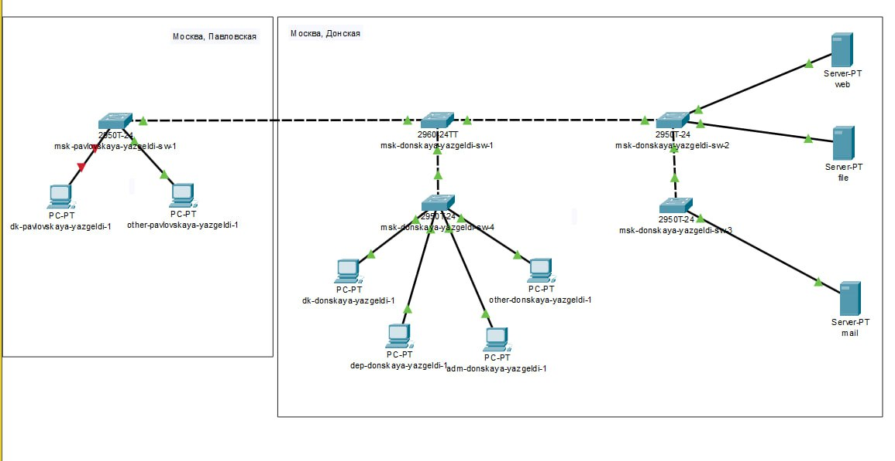
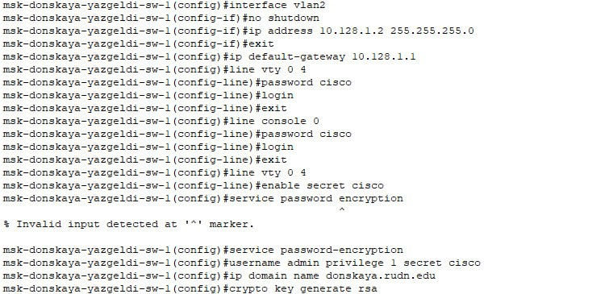
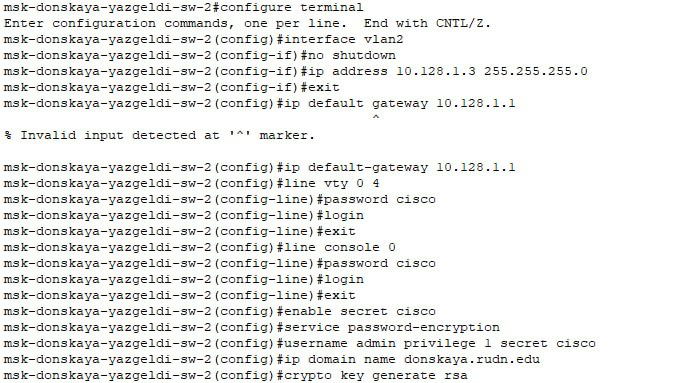
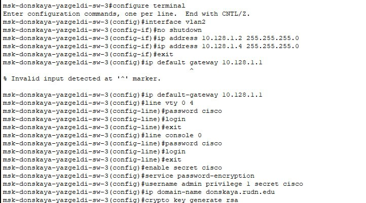
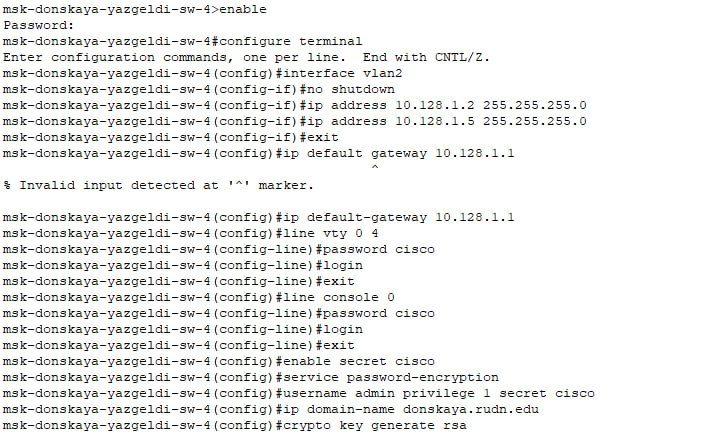
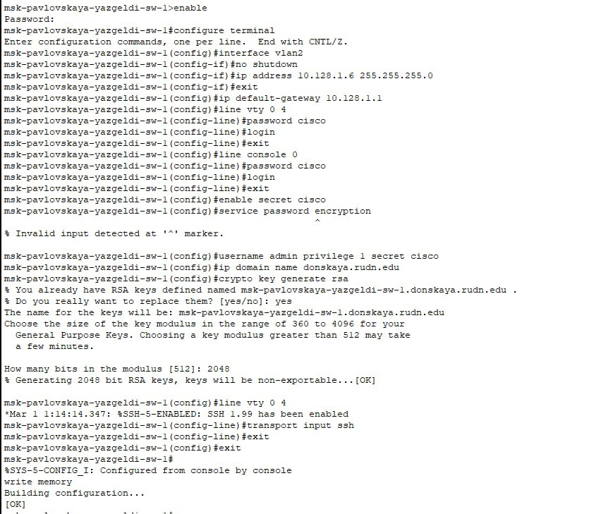

---
## Front matter
lang: ru-RU
title: Лабораторная работа № 4
subtitle: Администрирование локальных сетей
author:
  - Оразгелдиев Язгелди
institute:
  - Российский университет дружбы народов, Москва, Россия

## i18n babel
babel-lang: russian
babel-otherlangs: english

## Formatting pdf
toc: false
toc-title: Содержание
slide_level: 2
aspectratio: 169
section-titles: true
theme: metropolis
header-includes:
 - \metroset{progressbar=frametitle,sectionpage=progressbar,numbering=fraction}
---

# Информация

## Докладчик

  * Оразгелдиев Язгелди
  * студент
  * Российский университет дружбы народов
  * [orazgeldiyev.yazgeldi@gmail.com](mailto:orazgeldiyev.yazgeldi@gmail.com)
  * <https://github.com/YazgeldiOrazgeldiyev>

## Цели и задачи

- Провести подготовительную работу по первоначальной настройке коммутаторов сети.

# Задание

- Требуется сделать первоначальную настройку коммутаторов сети, представленной на схеме L1. Под первоначальной настройкой понимается указание имени устройства, его IP-адреса, настройка доступа по паролю к виртуальным терминалам и консоли, настройка удалённого доступа к устройству по ssh. При выполнении работы необходимо учитывать соглашение об именовании

## Содержание исследования

{#fig:001 width=70%}

## Содержание исследования

{#fig:002 width=50%}

## Содержание исследования

{#fig:004 width=50%}

## Содержание исследования

{#fig:006 width=50%}

## Содержание исследования

{#fig:008 width=50%}

## Содержание исследования

{#fig:010 width=50%}

## Результаты

- В ходе лабораторной работы провел подготовительную работу по первоначальной настройке коммутаторов сети.

