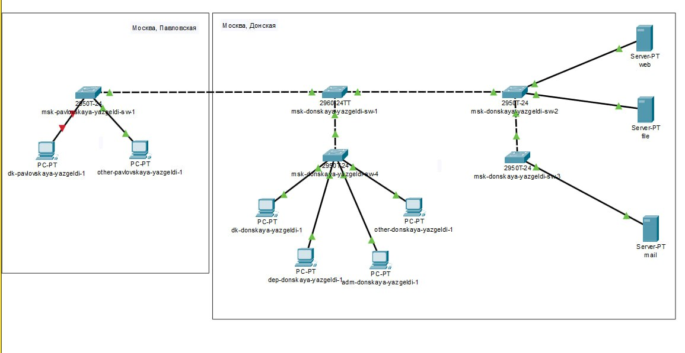
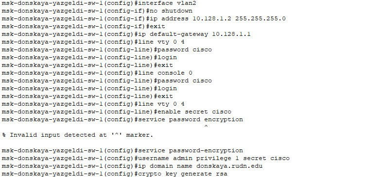
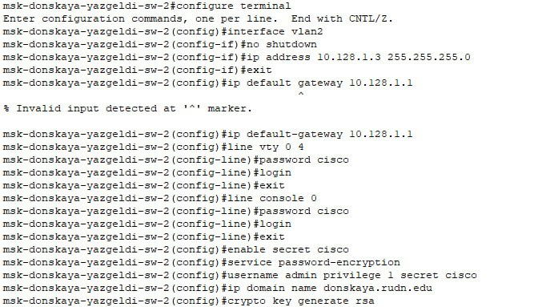
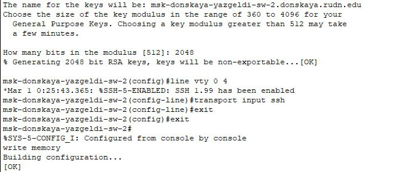
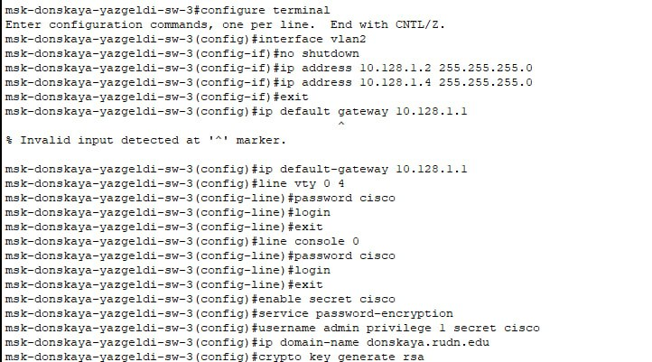
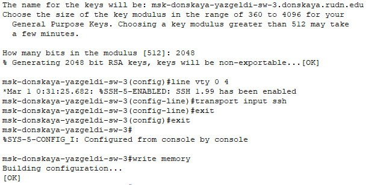
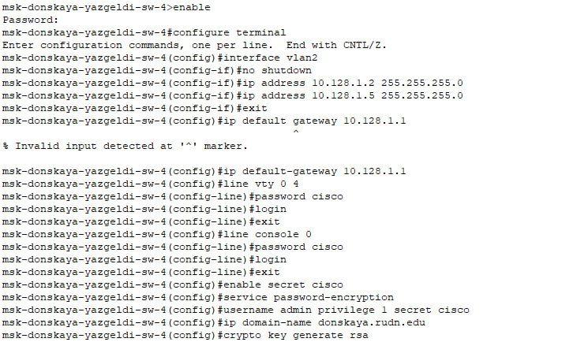
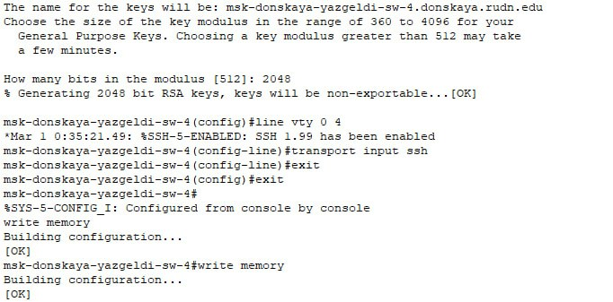
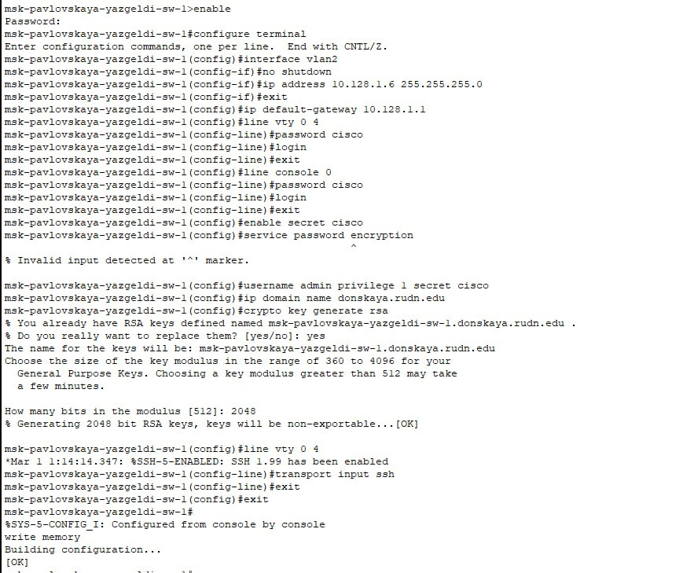

---
## Front matter
title: "Лабораторная работа № 4"
subtitle: "Администрирование локальных сетей"
author: "Оразгелдиев Язгелди"

## Generic otions
lang: ru-RU
toc-title: "Содержание"

## Bibliography
bibliography: bib/cite.bib
csl: pandoc/csl/gost-r-7-0-5-2008-numeric.csl

## Pdf output format
toc: true # Table of contents
toc-depth: 2
lof: true # List of figures
lot: true # List of tables
fontsize: 12pt
linestretch: 1.5
papersize: a4
documentclass: scrreprt
## I18n polyglossia
polyglossia-lang:
  name: russian
  options:
	- spelling=modern
	- babelshorthands=true
polyglossia-otherlangs:
  name: english
## I18n babel
babel-lang: russian
babel-otherlangs: english
## Fonts
mainfont: IBM Plex Serif
romanfont: IBM Plex Serif
sansfont: IBM Plex Sans
monofont: IBM Plex Mono
mathfont: STIX Two Math
mainfontoptions: Ligatures=Common,Ligatures=TeX,Scale=0.94
romanfontoptions: Ligatures=Common,Ligatures=TeX,Scale=0.94
sansfontoptions: Ligatures=Common,Ligatures=TeX,Scale=MatchLowercase,Scale=0.94
monofontoptions: Scale=MatchLowercase,Scale=0.94,FakeStretch=0.9
mathfontoptions:
## Biblatex
biblatex: true
biblio-style: "gost-numeric"
biblatexoptions:
  - parentracker=true
  - backend=biber
  - hyperref=auto
  - language=auto
  - autolang=other*
  - citestyle=gost-numeric
## Pandoc-crossref LaTeX customization
figureTitle: "Рис."
tableTitle: "Таблица"
listingTitle: "Листинг"
lofTitle: "Список иллюстраций"
lotTitle: "Список таблиц"
lolTitle: "Листинги"
## Misc options
indent: true
header-includes:
  - \usepackage{indentfirst}
  - \usepackage{float} # keep figures where there are in the text
  - \floatplacement{figure}{H} # keep figures where there are in the text
---

# Цель работы

Провести подготовительную работу по первоначальной настройке коммутаторов сети.

# Задание

Требуется сделать первоначальную настройку коммутаторов сети, представленной на схеме L1. Под первоначальной настройкой понимается указание имени устройства, его IP-адреса, настройка доступа по паролю к виртуальным терминалам и консоли, настройка удалённого доступа к устройству по ssh.
При выполнении работы необходимо учитывать соглашение об именовании

# Выполнение лабораторной работы

В логической рабочей области Packet Tracer разместил коммутаторы и оконечные устройства согласно схеме сети L1 и соединил их через соответствующие интерфейсы

{#fig:001 width=70%}

Используя типовую конфигурацию коммутатора, настройте все коммутаторы, изменяя название устройства и его IP-адрес согласно плану IP.
Так, для msk−donskaya-yazgeldi−sw−1 задали IP - 10.128.1.2 

{#fig:002 width=70%}

Для 2-го устройства msk−donskaya-yazgeldi−sw−2 задали ip - 10.128.1.3

{#fig:004 width=70%}

{#fig:005 width=70%}

Для 3-го устройства msk−donskaya-yazgeldi−sw−3 задали ip - 10.128.1.4

{#fig:006 width=70%}

{#fig:007 width=70%}

Для 4-го устройства msk−donskaya-yazgeldi−sw−4 задали ip - 10.128.1.5

{#fig:008 width=70%}

{#fig:009 width=70%}

Для 1-го устройства msk−pavlovskaya-yazgeldi−sw−1(Павловская) задали ip - 10.128.1.6

{#fig:010 width=70%}

# Выводы

В ходе лабораторной работы провел подготовительную работу по первоначальной настройке коммутаторов сети.
