---
## Front matter
lang: ru-RU
title: Лабораторная работа №5
subtitle: Администрирование локальных сетей
author:
  - Оразгелдиев Язгелди
institute:
  - Российский университет дружбы народов, Москва, Россия

## i18n babel
babel-lang: russian
babel-otherlangs: english

## Formatting pdf
toc: false
toc-title: Содержание
slide_level: 2
aspectratio: 169
section-titles: true
theme: metropolis
header-includes:
 - \metroset{progressbar=frametitle,sectionpage=progressbar,numbering=fraction}
---

# Информация

## Докладчик

  * Оразгелдиев Язгелди
  * студент
  * Российский университет дружбы народов
  * [orazgeldiyev.yazgeldi@gmail.com](mailto:orazgeldiyev.yazgeldi@gmail.com)
  * <https://github.com/YazgeldiOrazgeldiyev>

## Цели

Получить основные навыки по настройке VLAN на коммутаторах сети.

# Задание

1. На коммутаторах сети настроить Trunk-порты на соответствующих интерфейсах, связывающих коммутаторы между собой.

2. Коммутатор msk-donskaya-sw-1 настроить как VTP-сервер и прописать на нём номера и названия VLAN согласно табл. 3.1 из раздела 3.3.

3. Коммутаторы msk-donskaya-sw-2 — msk-donskaya-sw-4, msk-pavlovskaya-sw-1 настроить как VTP-клиенты, на интерфейсах указать принадлежность к соответствующему VLAN.

# Задание

4. На серверах прописать IP-адреса, как указано в табл. 3.2 из раздела 3.3.

5. На оконечных устройствах указать соответствующий адрес шлюза и прописать статические IP-адреса из диапазона соответствующей сети, следуя регламенту выделения ip-адресов.

6. Проверить доступность устройств, принадлежащих одному VLAN, и недоступность устройств, принадлежащих разным VLAN.

7. При выполнении работы необходимо учитывать соглашение об именовании.

## Содержание исследования

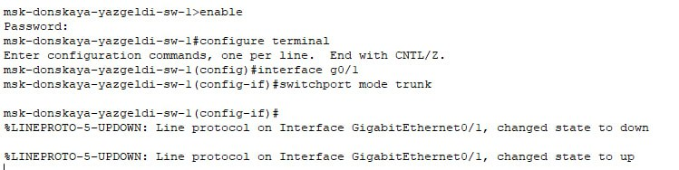{#fig:001 width=70%}

## Содержание исследования

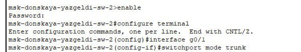{#fig:002 width=70%}

## Содержание исследования

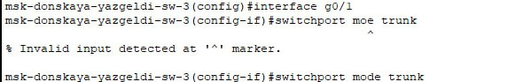{#fig:003 width=70%}

## Содержание исследования

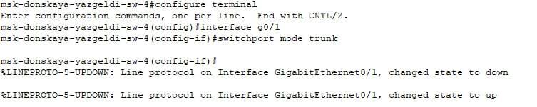{#fig:004 width=70%}

## Содержание исследования

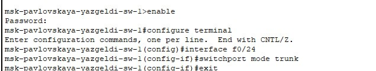{#fig:005 width=70%}

## Содержание исследования

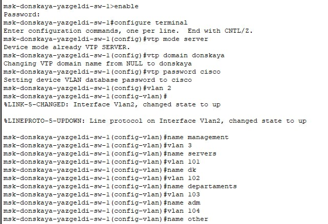{#fig:006 width=70%}

## Содержание исследования

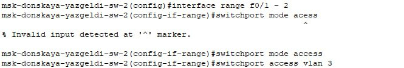{#fig:007 width=70%}

## Содержание исследования

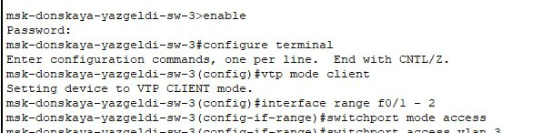{#fig:008 width=70%}

## Содержание исследования

{#fig:009 width=70%}

## Содержание исследования

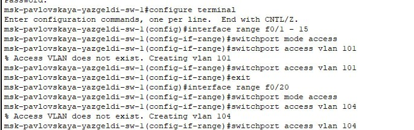{#fig:010 width=70%}

## Содержание исследования

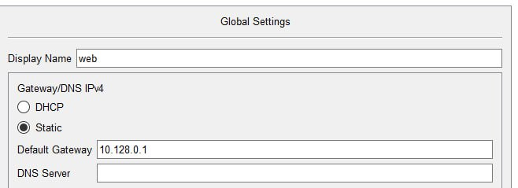{#fig:011 width=70%}

## Содержание исследования

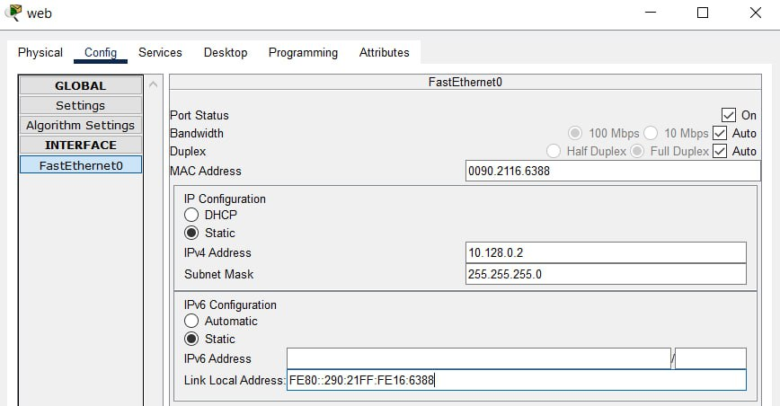{#fig:012 width=70%}

## Содержание исследования

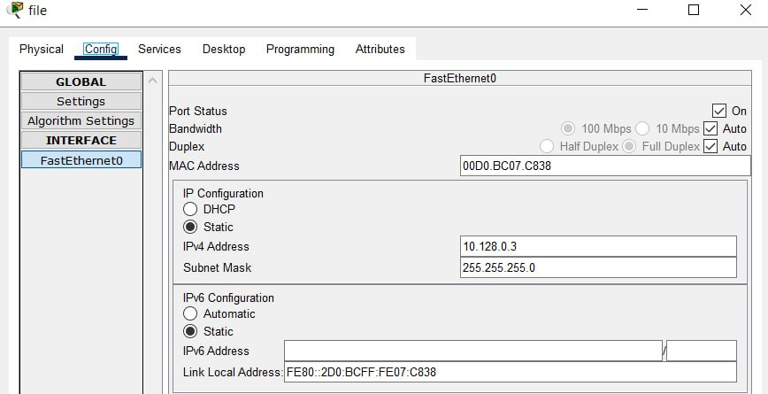{#fig:013 width=70%}

## Содержание исследования

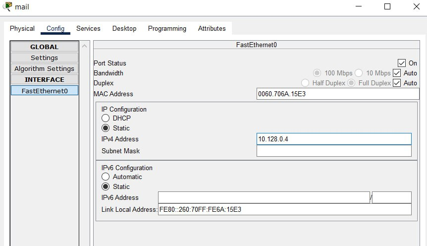{#fig:014 width=70%}

## Содержание исследования

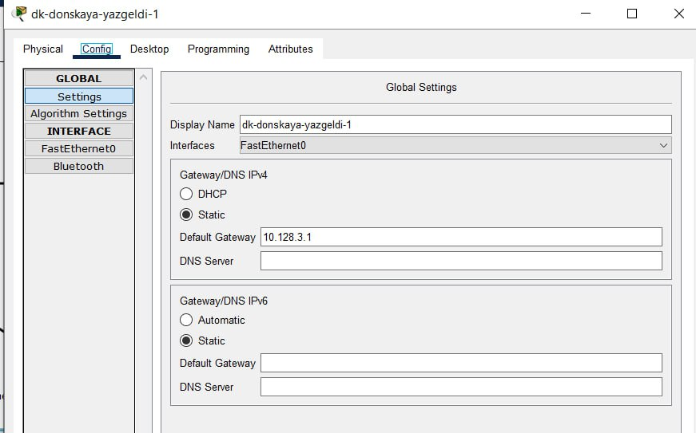{#fig:015 width=70%}

## Содержание исследования

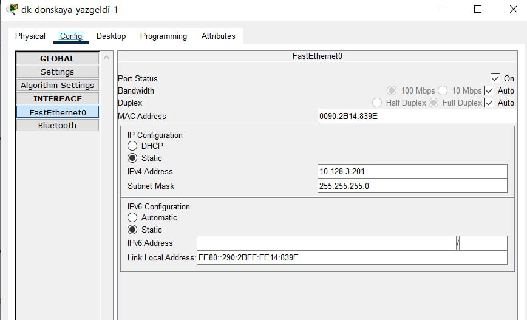{#fig:016 width=70%}

## Содержание исследования

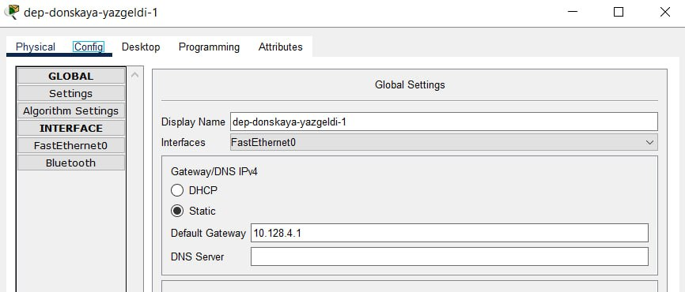{#fig:017 width=70%}

## Содержание исследования

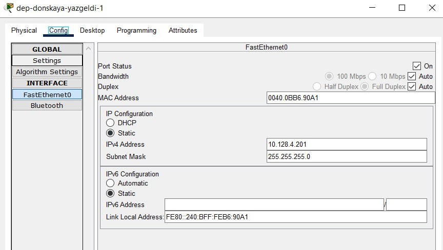{#fig:018 width=70%}

## Содержание исследования

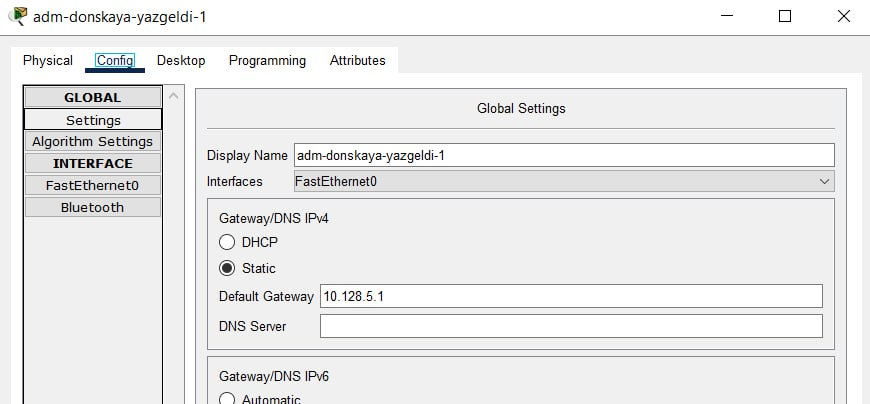{#fig:019 width=70%}

## Содержание исследования

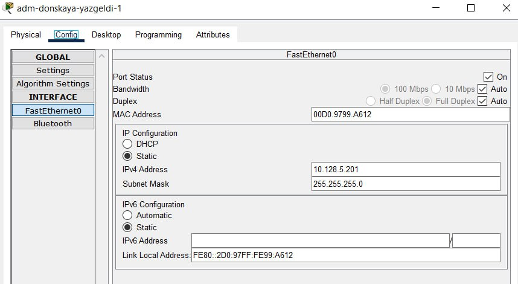{#fig:020 width=70%}

## Содержание исследования

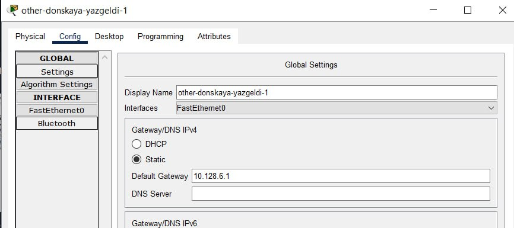{#fig:021 width=70%}

## Содержание исследования

{#fig:022 width=70%}

## Содержание исследования

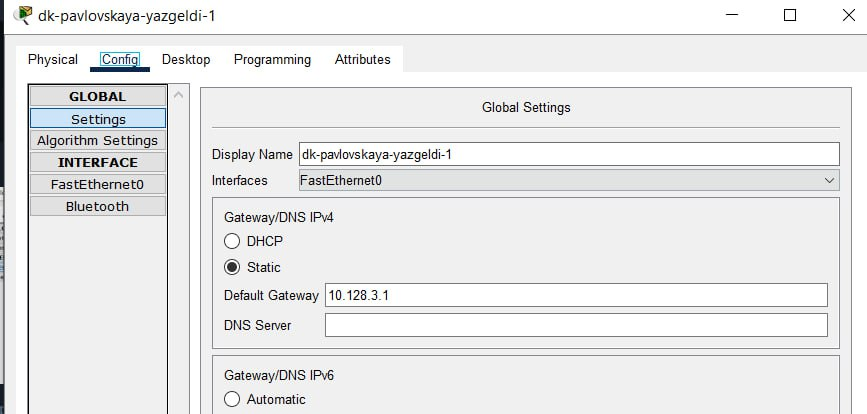{#fig:023 width=70%}

## Содержание исследования

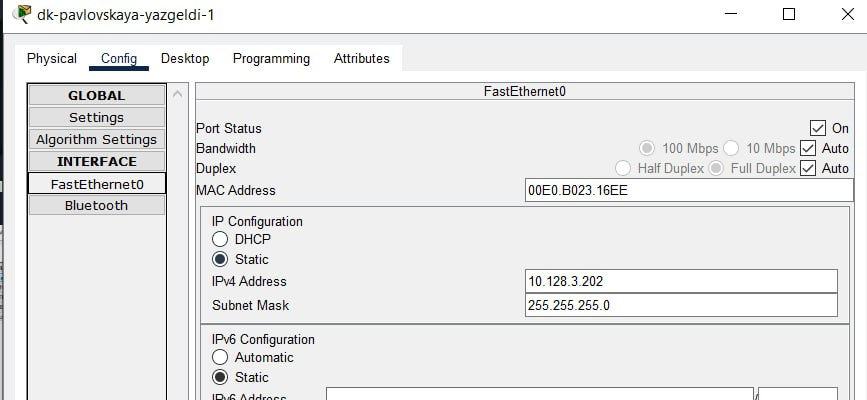{#fig:024 width=70%}

## Содержание исследования

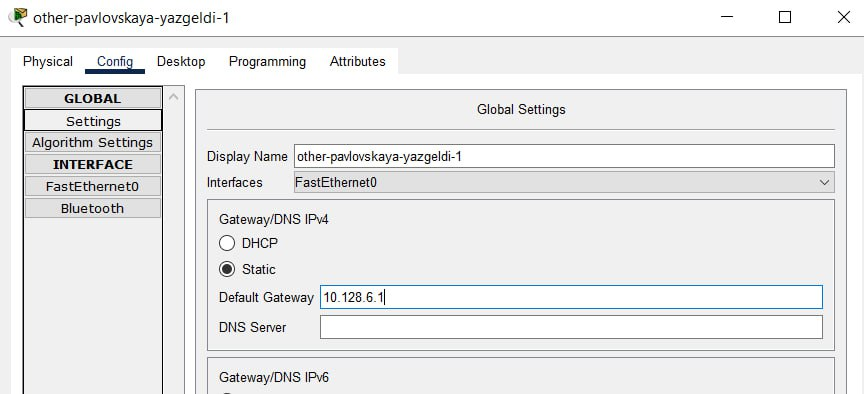{#fig:025 width=70%}

## Содержание исследования

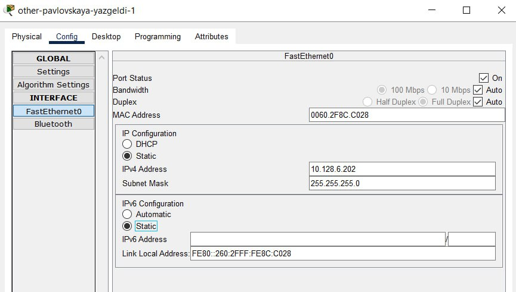{#fig:026 width=70%}

## Содержание исследования

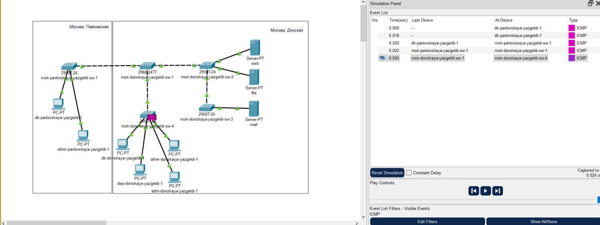{#fig:028 width=70%}

## Содержание исследования

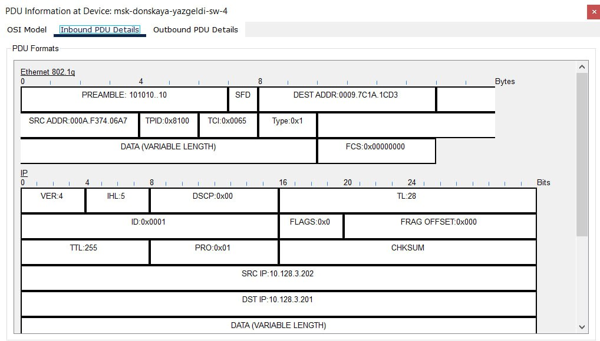{#fig:030 width=70%}

## Результаты

- Я получил основные навыки по настройке VLAN на коммутаторах сети.
