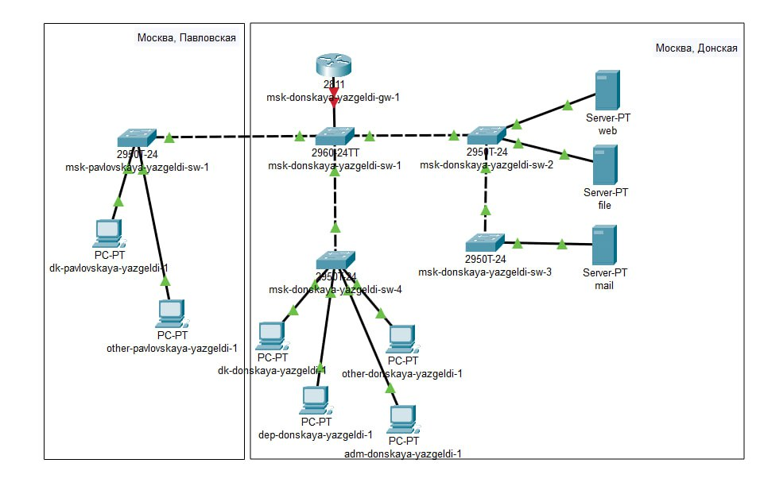
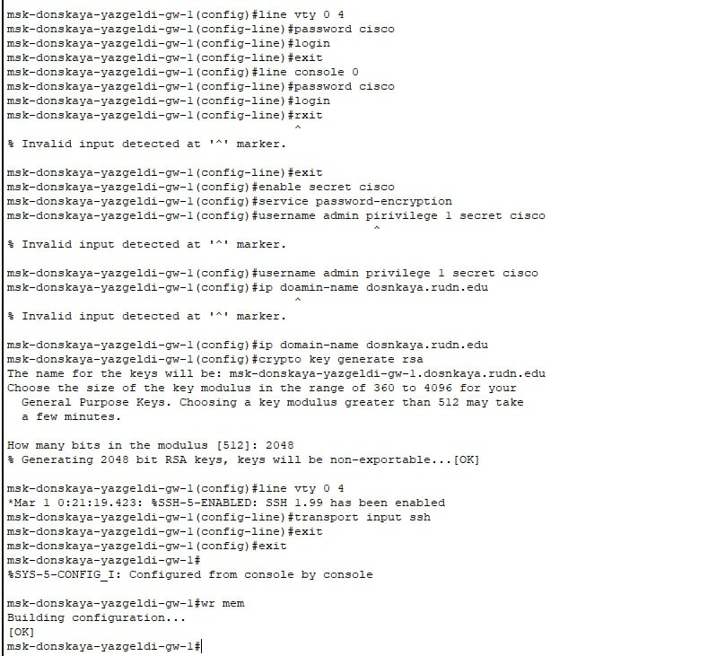
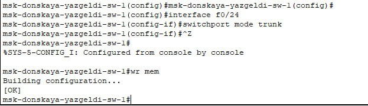
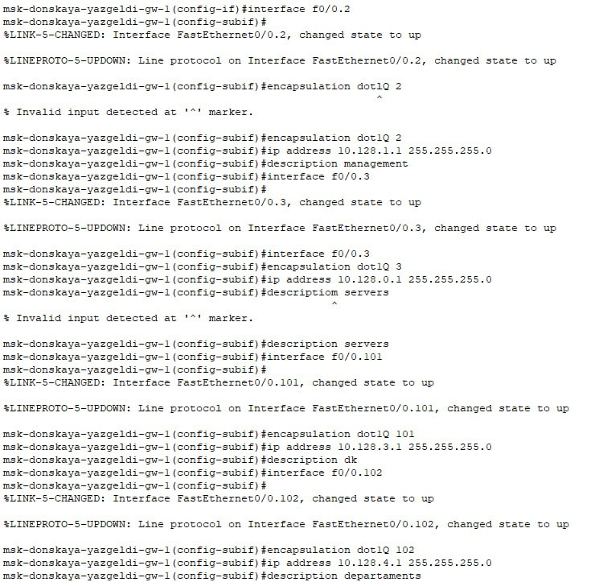
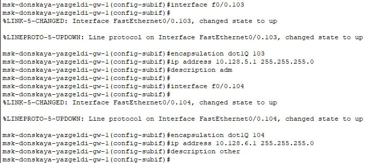
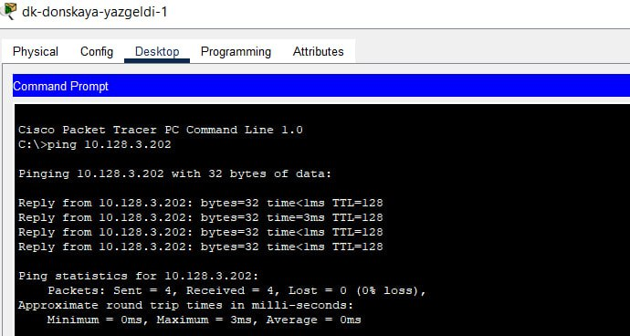
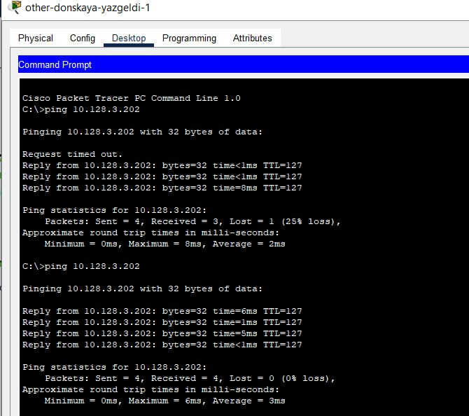
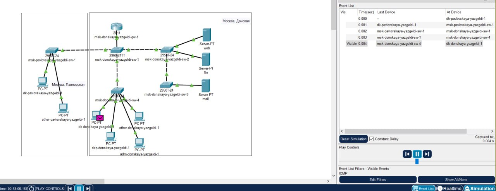
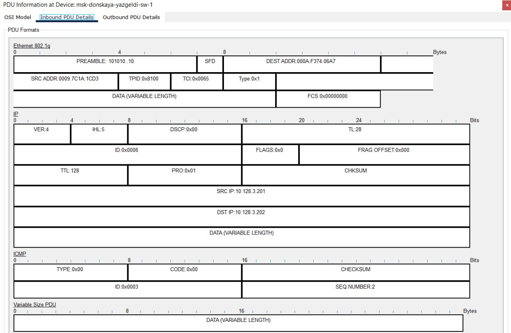

---
## Front matter
lang: ru-RU
title: Лабораторная работа №6
subtitle: Администрирование локальных сетей
author:
  - Оразгелдиев Язгелди
institute:
  - Российский университет дружбы народов, Москва, Россия

## i18n babel
babel-lang: russian
babel-otherlangs: english

## Formatting pdf
toc: false
toc-title: Содержание
slide_level: 2
aspectratio: 169
section-titles: true
theme: metropolis
header-includes:
 - \metroset{progressbar=frametitle,sectionpage=progressbar,numbering=fraction}
---

# Информация

## Докладчик

  * Оразгелдиев Язгелди
  * студент
  * Российский университет дружбы народов
  * [orazgeldiyev.yazgeldi@gmail.com](mailto:orazgeldiyev.yazgeldi@gmail.com)
  * <https://github.com/YazgeldiOrazgeldiyev>
  
## Цель работы

Настроить статическую маршрутизацию VLAN в сети.

## Задание

1. Добавить в локальную сеть маршрутизатор, провести его первоначальную
настройку.
2. Настроить статическую маршрутизацию VLAN.
3. При выполнении работы необходимо учитывать соглашение об именовании

## Содержание исследования

{#fig:001 width=50%}

## Содержание исследования

{#fig:002 width=50%}

## Содержание исследования

{#fig:003 width=50%}

## Содержание исследования

{#fig:004 width=40%}

## Содержание исследования

{#fig:005 width=50%}

## Содержание исследования

{#fig:006 width=50%}

## Содержание исследования

{#fig:007 width=50%}

## Содержание исследования

{#fig:008 width=50%}

## Содержание исследования

{#fig:009 width=50%}

## Результаты

В ходе лабораторной работы я настроил статическую маршрутизацию VLAN в сети.
