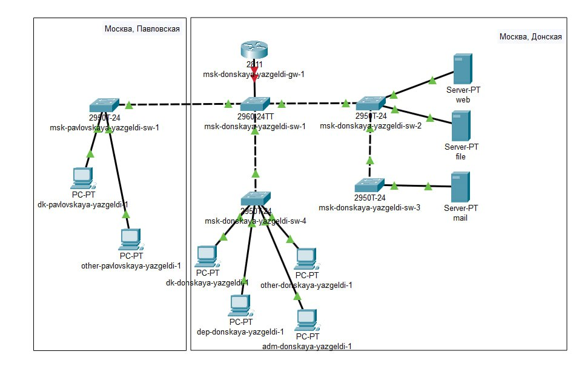
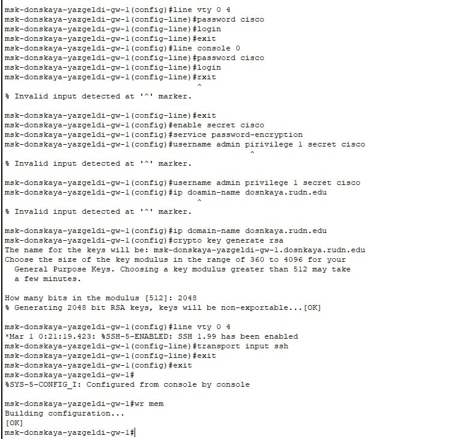
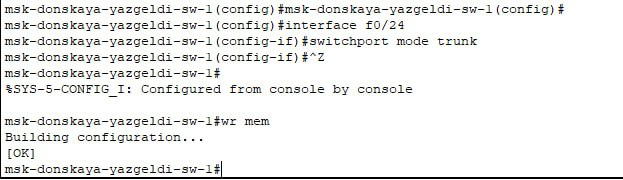
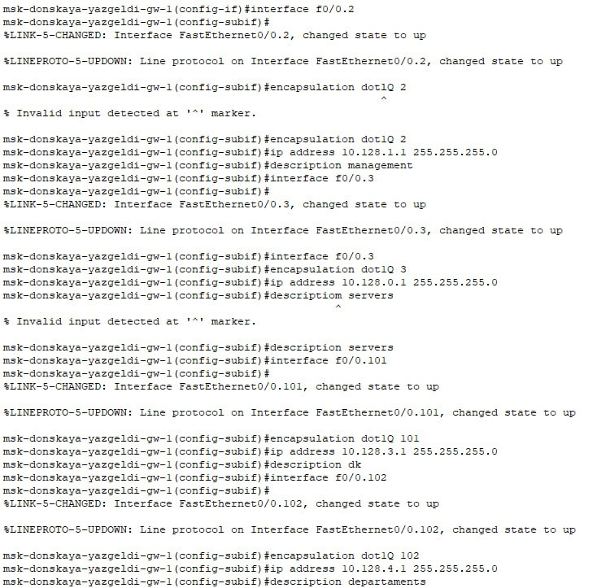
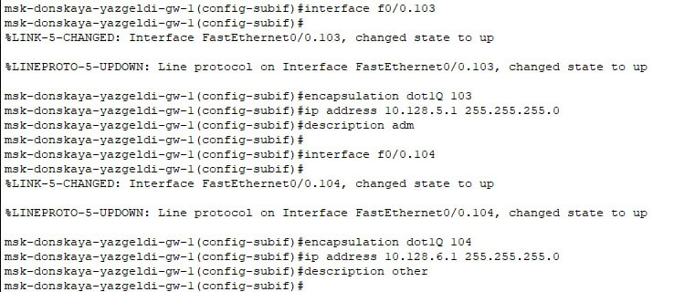
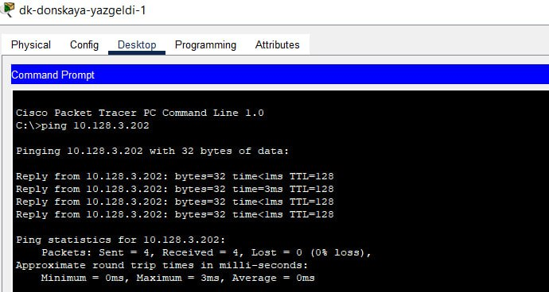
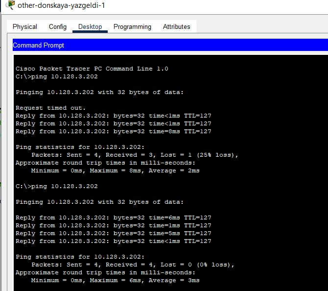
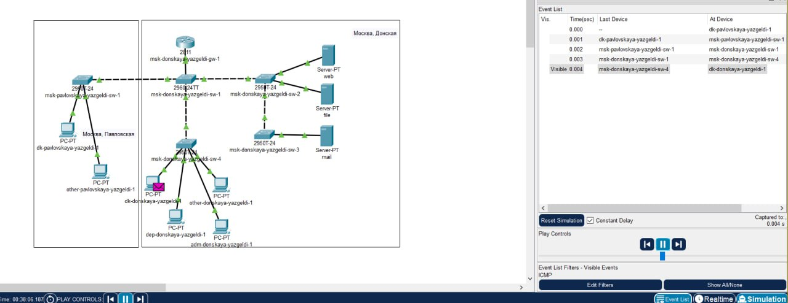
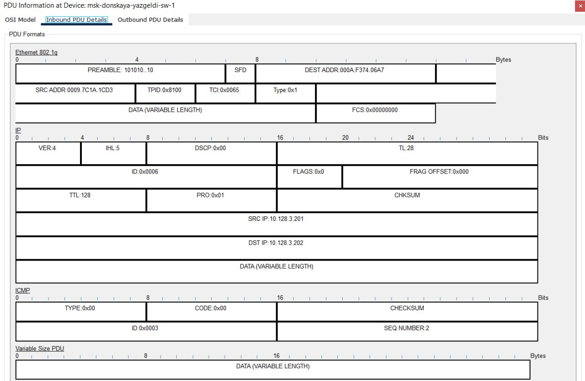

---
## Front matter
title: "Лабораторная работа № 6"
subtitle: "Статическая маршрутизация VLAN"
author: "Оразгелдиев Язгелди"

## Generic otions
lang: ru-RU
toc-title: "Содержание"

## Bibliography
bibliography: bib/cite.bib
csl: pandoc/csl/gost-r-7-0-5-2008-numeric.csl

## Pdf output format
toc: true # Table of contents
toc-depth: 2
lof: true # List of figures
lot: true # List of tables
fontsize: 12pt
linestretch: 1.5
papersize: a4
documentclass: scrreprt
## I18n polyglossia
polyglossia-lang:
  name: russian
  options:
	- spelling=modern
	- babelshorthands=true
polyglossia-otherlangs:
  name: english
## I18n babel
babel-lang: russian
babel-otherlangs: english
## Fonts
mainfont: IBM Plex Serif
romanfont: IBM Plex Serif
sansfont: IBM Plex Sans
monofont: IBM Plex Mono
mathfont: STIX Two Math
mainfontoptions: Ligatures=Common,Ligatures=TeX,Scale=0.94
romanfontoptions: Ligatures=Common,Ligatures=TeX,Scale=0.94
sansfontoptions: Ligatures=Common,Ligatures=TeX,Scale=MatchLowercase,Scale=0.94
monofontoptions: Scale=MatchLowercase,Scale=0.94,FakeStretch=0.9
mathfontoptions:
## Biblatex
biblatex: true
biblio-style: "gost-numeric"
biblatexoptions:
  - parentracker=true
  - backend=biber
  - hyperref=auto
  - language=auto
  - autolang=other*
  - citestyle=gost-numeric
## Pandoc-crossref LaTeX customization
figureTitle: "Рис."
tableTitle: "Таблица"
listingTitle: "Листинг"
lofTitle: "Список иллюстраций"
lotTitle: "Список таблиц"
lolTitle: "Листинги"
## Misc options
indent: true
header-includes:
  - \usepackage{indentfirst}
  - \usepackage{float} # keep figures where there are in the text
  - \floatplacement{figure}{H} # keep figures where there are in the text
---

# Цель работы

Настроить статическую маршрутизацию VLAN в сети.

# Задание

1. Добавить в локальную сеть маршрутизатор, провести его первоначальную
настройку.
2. Настроить статическую маршрутизацию VLAN.
3. При выполнении работы необходимо учитывать соглашение об именовании

# Выполнение лабораторной работы

В логической области проекта разместил маршрутизатор Cisco 2811, подключил его к порту 24 коммутатора msk-donskaya-sw-1.

{#fig:001 width=70%}

Сконфигурировал маршрутизатор, задав в нём имя, пароль для доступа к консоли и настроил удаленное подключение по ssh.

{#fig:002 width=70%}

Настроил порт 24 коммутатора msk-donskaya-sw-1 как trunk-порт

{#fig:003 width=70%}

На интерфейсе f0/0 маршрутизатора msk-donskaya-gw-1 настройте виртуальные интерфейсы, соответствующие номерам VLAN. Согласно таблице IP-адресов задайте соответствующие IP-адреса на виртуальных интерфейсах

{#fig:004 width=70%}

{#fig:005 width=70%}

Проверьте доступность оконечных устройств из разных VLAN. Сначала пропинговал dk-pavlovskaya-yazgeldi-1 с dk-donskaya-yazgeldi-1(один VLAN). Затем пропинговал dk-pavlovskaya-yazgeldi-1 с other-donskaya-yazgeldi-1(разные VLAN)

{#fig:006 width=70%}

{#fig:007 width=70%}

Используя режим симуляции в Packet Tracer, изучите процесс передвижения пакета ICMP по сети. Изучил содержимое передаваемого пакета и заголовки задействованных протоколов.

{#fig:008 width=70%}

{#fig:009 width=70%}

# Выводы

В ходе лабораторной работы я настроил статическую маршрутизацию VLAN в сети.

