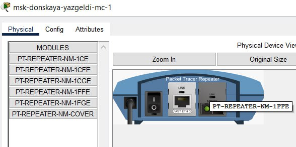

---
## Front matter
lang: ru-RU
title: Лабораторная работа №7
subtitle: Учёт физических параметров сети
author:
  - Оразгелдиев Язгелди
institute:
  - Российский университет дружбы народов, Москва, Россия

## i18n babel
babel-lang: russian
babel-otherlangs: english

## Formatting pdf
toc: false
toc-title: Содержание
slide_level: 2
aspectratio: 169
section-titles: true
theme: metropolis
header-includes:
 - \metroset{progressbar=frametitle,sectionpage=progressbar,numbering=fraction}
---

# Информация

## Докладчик

  * Оразгелдиев Язгелди
  * студент
  * Российский университет дружбы народов
  * [orazgeldiyev.yazgeldi@gmail.com](mailto:orazgeldiyev.yazgeldi@gmail.com)
  * <https://github.com/YazgeldiOrazgeldiyev>

## Цель работы

Получить навыки работы с физической рабочей областью Packet Tracer, а также учесть физические параметры сети.

## Задание

Требуется заменить соединение между коммутаторами двух территорий msk-donskaya-sw-1 и msk-pavlovskaya-sw-1 на соединение, учитывающее физические параметры сети, а именно — расстояние между двумя
территориями. При выполнении работы необходимо учитывать соглашение об именовании

## Содержание исследования

{#fig:001 width=50%}

## Содержание исследования

{#fig:002 width=50%}

## Содержание исследования

{#fig:003 width=50%}

## Содержание исследования

{#fig:004 width=30%}

## Содержание исследования

{#fig:005 width=50%}

## Содержание исследования

{#fig:006 width=50%}

## Содержание исследования

{#fig:007 width=50%}

## Содержание исследования

{#fig:008 width=50%}

## Содержание исследования

{#fig:009 width=50%}

## Содержание исследования

{#fig:010 width=50%}

## Содержание исследования

{#fig:011 width=50%}

## Содержание исследования

{#fig:012 width=50%}

## Содержание исследования

{#fig:013 width=50%}

## Содержание исследования

{#fig:014 width=50%}

## Результаты

В ходе лабораторной работы получил навыки работы с физической рабочей областью Packet Tracer, а также учесть физические параметры сети.
