---
## Front matter
title: "Лабораторная работа № 8"
subtitle: "Настройка сетевых сервисов DHCP"
author: "Оразгелдиев Язгелди"

## Generic otions
lang: ru-RU
toc-title: "Содержание"

## Bibliography
bibliography: bib/cite.bib
csl: pandoc/csl/gost-r-7-0-5-2008-numeric.csl

## Pdf output format
toc: true # Table of contents
toc-depth: 2
lof: true # List of figures
lot: true # List of tables
fontsize: 12pt
linestretch: 1.5
papersize: a4
documentclass: scrreprt
## I18n polyglossia
polyglossia-lang:
  name: russian
  options:
	- spelling=modern
	- babelshorthands=true
polyglossia-otherlangs:
  name: english
## I18n babel
babel-lang: russian
babel-otherlangs: english
## Fonts
mainfont: IBM Plex Serif
romanfont: IBM Plex Serif
sansfont: IBM Plex Sans
monofont: IBM Plex Mono
mathfont: STIX Two Math
mainfontoptions: Ligatures=Common,Ligatures=TeX,Scale=0.94
romanfontoptions: Ligatures=Common,Ligatures=TeX,Scale=0.94
sansfontoptions: Ligatures=Common,Ligatures=TeX,Scale=MatchLowercase,Scale=0.94
monofontoptions: Scale=MatchLowercase,Scale=0.94,FakeStretch=0.9
mathfontoptions:
## Biblatex
biblatex: true
biblio-style: "gost-numeric"
biblatexoptions:
  - parentracker=true
  - backend=biber
  - hyperref=auto
  - language=auto
  - autolang=other*
  - citestyle=gost-numeric
## Pandoc-crossref LaTeX customization
figureTitle: "Рис."
tableTitle: "Таблица"
listingTitle: "Листинг"
lofTitle: "Список иллюстраций"
lotTitle: "Список таблиц"
lolTitle: "Листинги"
## Misc options
indent: true
header-includes:
  - \usepackage{indentfirst}
  - \usepackage{float} # keep figures where there are in the text
  - \floatplacement{figure}{H} # keep figures where there are in the text
---

# Цель работы

Приобретение практических навыков по настройке динамического распределения IP-адресов посредством протокола DHCP (Dynamic Host Configuration Protocol) в локальной сети.

# Задание

1. Добавить DNS-записи для домена donskaya.rudn.ru на сервер dns.
2. Настроить DHCP-сервис на маршрутизаторе.
3. Заменить в конфигурации оконечных устройствах статическое распределение адресов на динамическое.
4. При выполнении работы необходимо учитывать соглашение об именовании

# Выполнение лабораторной работы

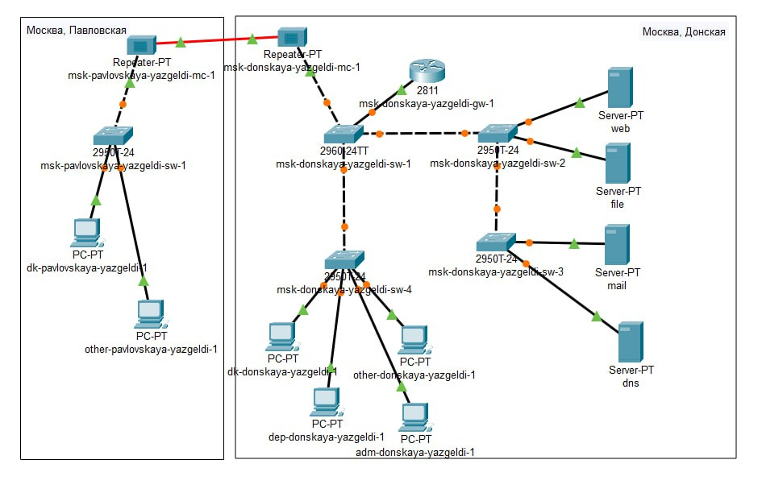{#fig:001 width=70%}

В логическую рабочую область проекта добавил сервер dns и подключил его к коммутатору msk-donskaya-sw-3 через порт Fa0/2, не забыв активировать порт при помощи соответствующих команд на коммутаторе. 

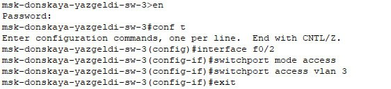{#fig:002 width=70%}

В конфигурации сервера указал в качестве адреса шлюза 10.128.0.1, а в качестве адреса самого сервера — 10.128.0.5 с соответствующей маской 255.255.255.0.

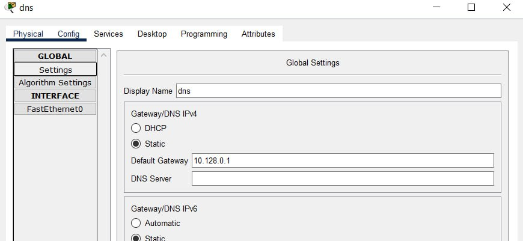{#fig:003 width=70%}

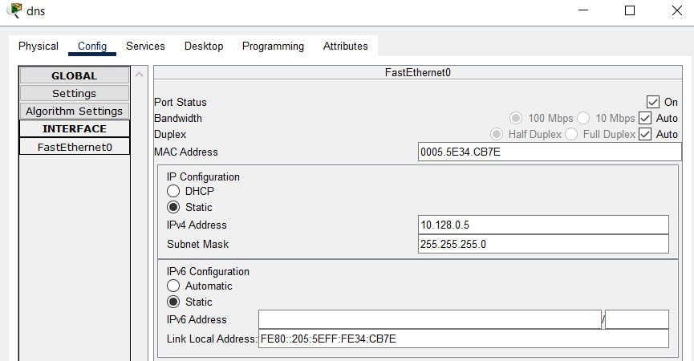{#fig:004 width=70%}

Настроим сервис DNS (рис. 8.2):
- в конфигурации сервера выберем службу DNS, активируем её (выбрав флаг On);
- в поле Type в качестве типа записи DNS выберем записи типа A (A Record);
- в поле Name укажем доменное имя, по которому можно обратиться, например, к web-серверу — www.donskaya.rudn.ru, затем укажем его IP-адрес в соответствующем поле 10.128.0.2;
- нажав на кнопку Add , добавим DNS-запись на сервер;
- аналогичным образом добавим DNS-записи для серверов mail, file, dns согласно распределению адресов из табл. 3.2;
- сохранил конфигурацию сервера.

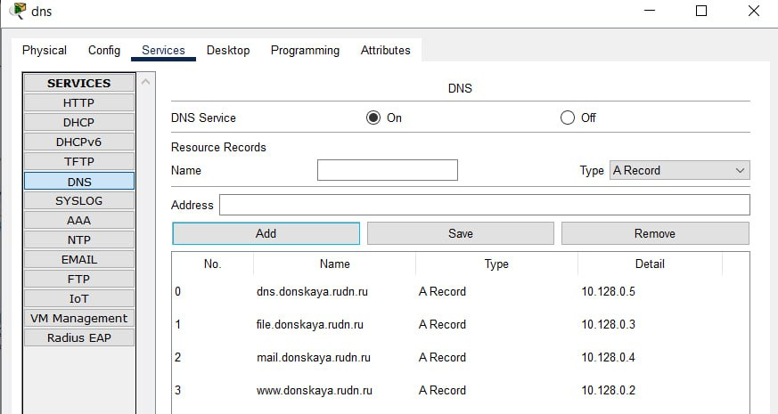{#fig:005 width=70%}

Настроили DHCP-сервис на маршрутизаторе, используя приведённые ниже команды для каждой выделенной сети: указали IP-адрес DNS-сервера; затем перешли к настройке DHCP; задали название конфигурируемому диапазону адресов (пулу адресов), указали адрес сети, а также адреса шлюза и DNS-сервера; задали пулы адресов, исключаемых из динамического
распределения

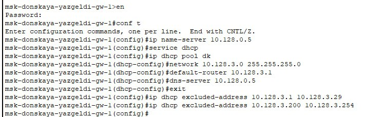{#fig:006 width=70%}

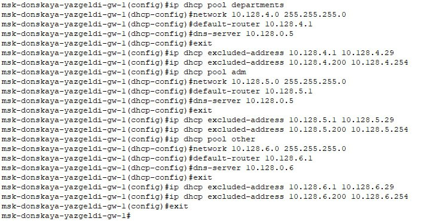{#fig:007 width=70%}

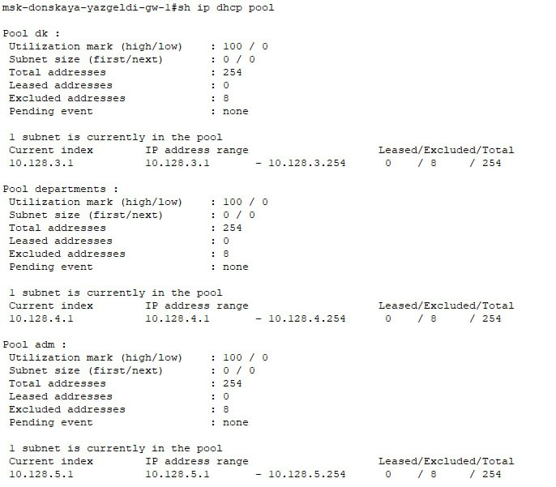{#fig:008 width=70%}

Посмотрим инфу о привязанных выданных адресов, но пока их нет

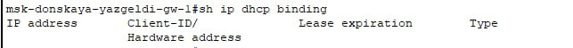{#fig:009 width=70%}

Смотрим статические адреса с помощью команды

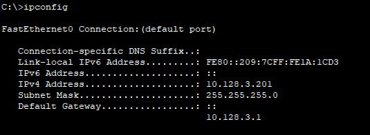{#fig:010 width=70%}

На оконечных устройствах заменим в настройках статическое распределение адресов на динамическое.

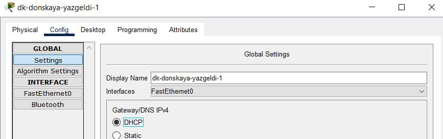{#fig:011 width=70%}

Проверим, какие адреса выделяются оконечным устройствам, а также доступность устройств из разных подсетей.

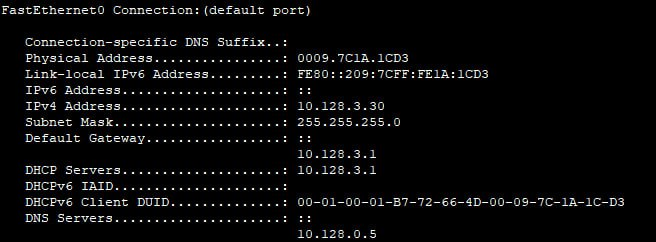{#fig:012 width=70%}

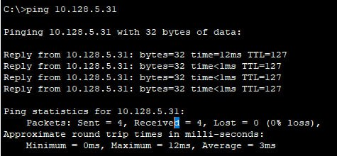{#fig:013 width=70%}

В режиме симуляции изучим, каким образом происходит запрос адреса по протоколу DHCP (какие сообщения и какие отклики передаются по сети).

{#fig:014 width=70%}

Еще смотрим список событий для более детального изучения запроса. оконечное устройво отправляет запрос на получение ip-адреса по протоколу DHCP. Сначала DHCP пакет рассылается по всем устройствам сети и принимается маршрутизатором. В заголовках DHCP при это указан только МАС-адрес устройства, которому нужен ip-адрес, а его еще нет

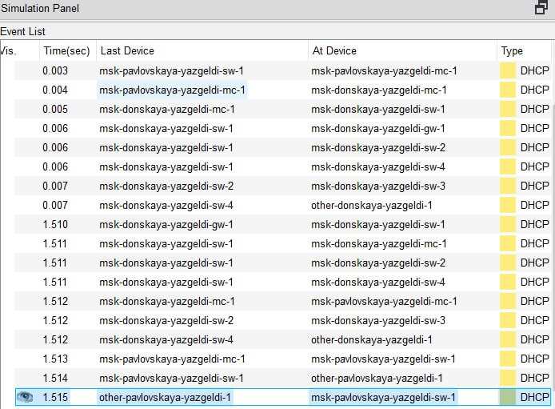{#fig:015 width=70%}

# Выводы

Я приобрел практические навыки по настройке динамического распределения IP-адресов посредством протокола DHCP (Dynamic Host Configuration Protocol) в локальной сети.
