---
## Front matter
title: "Лабораторная работа № 9"
subtitle: "Использование протокола STP. Агрегирование каналов"
author: "Оразгелдиев Язгелди"

## Generic otions
lang: ru-RU
toc-title: "Содержание"

## Bibliography
bibliography: bib/cite.bib
csl: pandoc/csl/gost-r-7-0-5-2008-numeric.csl

## Pdf output format
toc: true # Table of contents
toc-depth: 2
lof: true # List of figures
lot: true # List of tables
fontsize: 12pt
linestretch: 1.5
papersize: a4
documentclass: scrreprt
## I18n polyglossia
polyglossia-lang:
  name: russian
  options:
	- spelling=modern
	- babelshorthands=true
polyglossia-otherlangs:
  name: english
## I18n babel
babel-lang: russian
babel-otherlangs: english
## Fonts
mainfont: IBM Plex Serif
romanfont: IBM Plex Serif
sansfont: IBM Plex Sans
monofont: IBM Plex Mono
mathfont: STIX Two Math
mainfontoptions: Ligatures=Common,Ligatures=TeX,Scale=0.94
romanfontoptions: Ligatures=Common,Ligatures=TeX,Scale=0.94
sansfontoptions: Ligatures=Common,Ligatures=TeX,Scale=MatchLowercase,Scale=0.94
monofontoptions: Scale=MatchLowercase,Scale=0.94,FakeStretch=0.9
mathfontoptions:
## Biblatex
biblatex: true
biblio-style: "gost-numeric"
biblatexoptions:
  - parentracker=true
  - backend=biber
  - hyperref=auto
  - language=auto
  - autolang=other*
  - citestyle=gost-numeric
## Pandoc-crossref LaTeX customization
figureTitle: "Рис."
tableTitle: "Таблица"
listingTitle: "Листинг"
lofTitle: "Список иллюстраций"
lotTitle: "Список таблиц"
lolTitle: "Листинги"
## Misc options
indent: true
header-includes:
  - \usepackage{indentfirst}
  - \usepackage{float} # keep figures where there are in the text
  - \floatplacement{figure}{H} # keep figures where there are in the text
---

# Цель работы

Изучение возможностей протокола STP и его модификаций по обеспечению отказоустойчивости сети, агрегированию интерфейсов и перераспределению нагрузки между ними.

# Задание

1. Сформируйте резервное соединение между коммутаторами msk-donskaya-sw-1 и msk-donskaya-sw-3.
2. Настройте балансировку нагрузки между резервными соединениями.
3. Настройте режим Portfast на тех интерфейсах коммутаторов, к которым подключены серверы.
4. Изучите отказоустойчивость резервного соединения.
5. Сформируйте и настройте агрегированное соединение интерфейсов Fa0/20 – Fa0/23 между коммутаторами msk-donskaya-sw-1 и msk-donskaya-sw-4.
6. При выполнении работы необходимо учитывать соглашение об именовании

# Выполнение лабораторной работы

Сформировали резервное соединение между коммутаторами msk-donskaya-sw-1 и msk-donskaya-sw-3

- заменили соединение между коммутаторами msk-donskaya-sw-1 (Gig0/2) и msk-donskaya-sw-4 (Gig0/1) на соединение между коммутаторами msk-donskaya-sw-1 (Gig0/2) и msk-donskaya-sw-3 (Gig0/2);
- сделали порт на интерфейсе Gig0/2 коммутатора msk-donskaya-sw-3 транковым
- соединение между коммутаторами msk-donskaya-sw-1 и msk-donskayasw-4 сделали через интерфейсы Fa0/23, не забыв активировать их в транковом режиме.

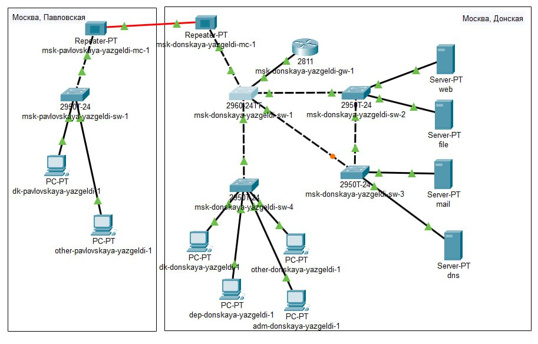{#fig:001 width=70%}

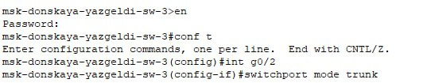{#fig:002 width=70%}

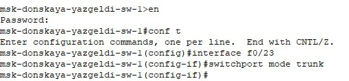{#fig:003 width=70%}

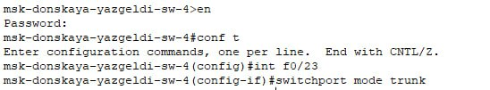{#fig:004 width=70%}

С оконечного устройства dk-donskaya-1 пропинговали серверы mail и web.

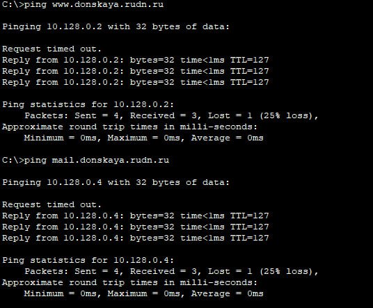{#fig:005 width=70%}

В режиме симуляции проследили движение пакетов ICMP. Убедились, что движение пакетов происходит через коммутатор msk-donskaya-sw-2.

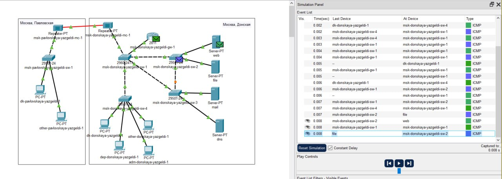{#fig:006 width=70%}

На коммутаторе msk-donskaya-sw-2 посмотрели состояние протокола STP для vlan 3

В качестве корневого коммутатора STP настроили коммутатор msk-donskaya-sw-1

Используя режим симуляции, убедились, что пакеты ICMP пойдут от хоста dk-donskaya-1 до mail через коммутаторы msk-donskaya-sw-1 и mskdonskaya-sw-3, а от хоста dk-donskaya-1 до web через коммутаторы
msk-donskaya-sw-1 и msk-donskaya-sw-2.

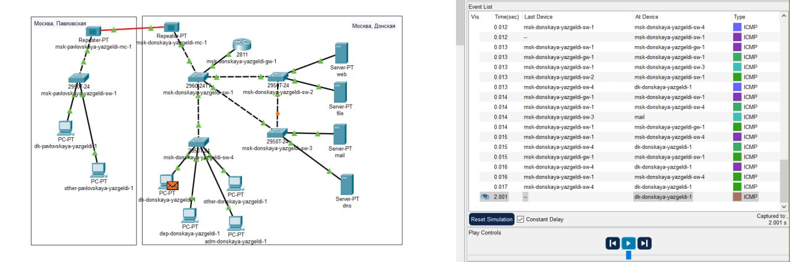{#fig:007 width=70%}

Настроили режим Portfast на тех интерфейсах коммутаторов, к которым подключены серверы

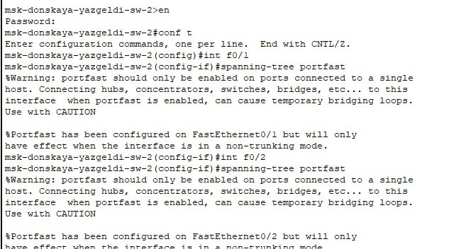{#fig:008 width=70%}

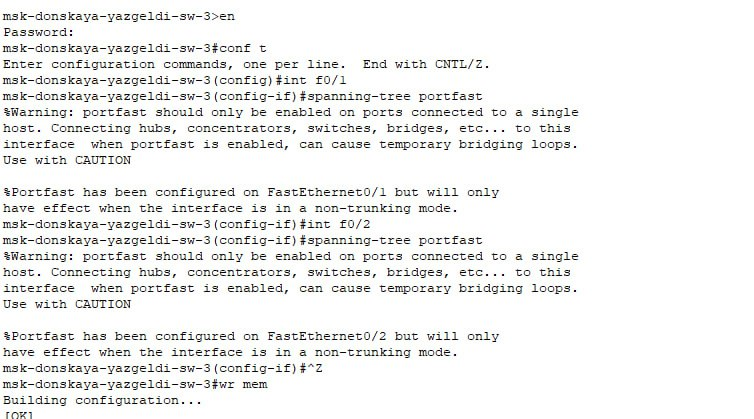{#fig:009 width=70%}

Изучили отказоустойчивость протокола а STP и время восстановления соединения при переключении на резервное соединение. Для этого использовали команду ping -n 1000 mail.donskaya.rudn.ru на хосте dk-donskaya-1, а разрыв соединения обеспечили переводом соответствующего интерфейса коммутатора в состояние shutdown.

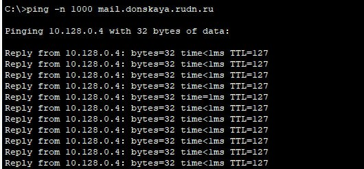{#fig:010 width=70%}

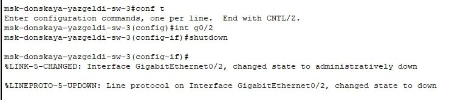{#fig:011 width=70%}

Мы видим что на время восстановления требуется много времени. После восстановления, пингование работает как обычно

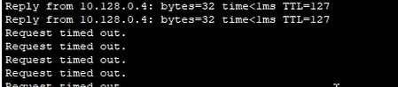{#fig:012 width=70%}

Переключим коммутаторы в режим работы по протоколу Rapid PVST+. 

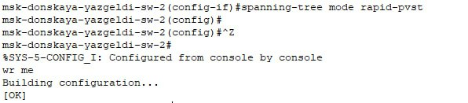{#fig:013 width=70%}

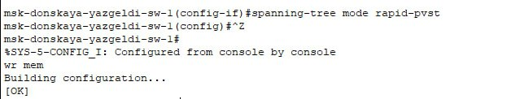{#fig:014 width=70%}

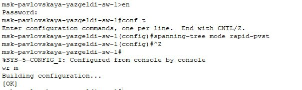{#fig:015 width=70%}

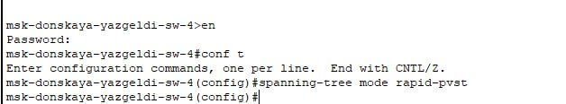{#fig:016 width=70%}

Теперь изучим отказоустойчивость протокола Rapid PVST+ и время восстановления соединения при переключении на резервное соединение.

{#fig:017 width=70%}

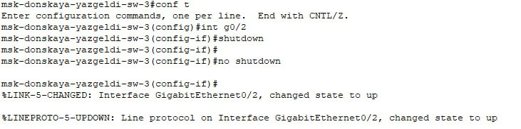{#fig:018 width=70%}

Как мы видим, задержки по времени после разрыва не было, и соединение моментально восстановилось. При возвращении старого соединения, потребовался 1 пинг, что довольно быстро по сравнению с прошлым случаем. Далее работа шла как обычно.

Сформировали агрегированное соединение интерфейсов Fa0/20 – Fa0/23 между коммутаторами msk-donskaya-sw-1 и msk-donskaya-sw-4

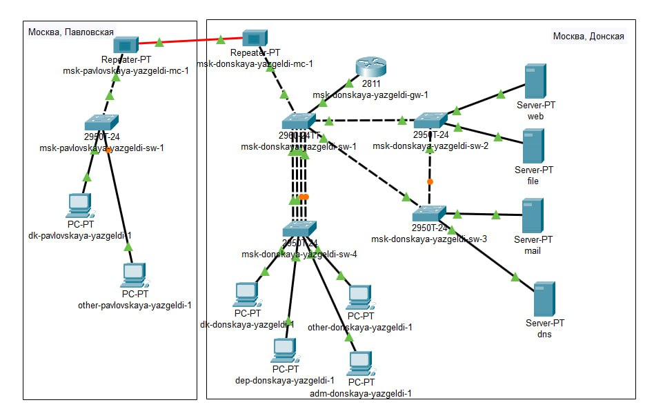{#fig:019 width=70%}

Настроили агрегирование каналов

{#fig:020 width=70%}

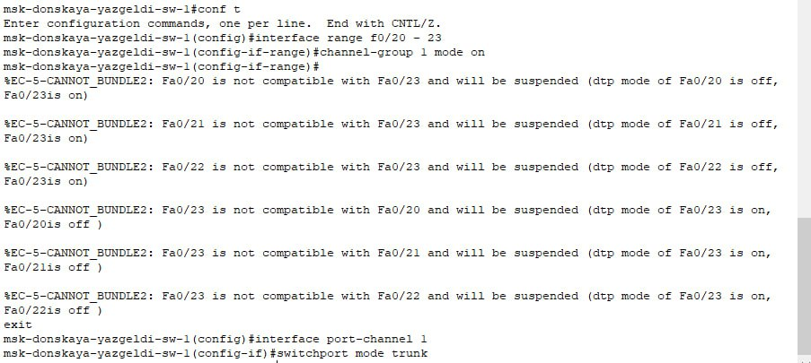{#fig:021 width=70%}

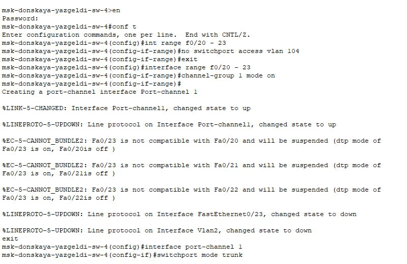{#fig:022 width=70%}

# Выводы

В ходе лабораторной работы изучили возможностей протокола STP и его модификаций по обеспечению отказоустойчивости сети, агрегированию интерфейсов и перераспределению нагрузки между ними.
