---
## Front matter
lang: ru-RU
title: Лабораторная работа № 11
subtitle: Настройка NAT.Планирование
author:
  - Оразгелдиев Язгелди
institute:
  - Российский университет дружбы народов, Москва, Россия

## i18n babel
babel-lang: russian
babel-otherlangs: english

## Formatting pdf
toc: false
toc-title: Содержание
slide_level: 2
aspectratio: 169
section-titles: true
theme: metropolis
header-includes:
 - \metroset{progressbar=frametitle,sectionpage=progressbar,numbering=fraction}
---

# Информация

## Докладчик

  * Оразгелдиев Язгелди
  * студент
  * Российский университет дружбы народов
  * [orazgeldiyev.yazgeldi@gmail.com](mailto:orazgeldiyev.yazgeldi@gmail.com)
  * <https://github.com/YazgeldiOrazgeldiyev>

## Цель работы

Провести подготовительные мероприятия по подключению локальной сети организации к Интернету.

## Задание

1. Построить схему подсоединения локальной сети к Интернету;
2. Построить модельные сети провайдера и сети Интернет;
3. Построить схемы сетей L1, L2, L3;
4. При выполнении работы необходимо учитывать соглашение об именовании.

## Содержание исследования

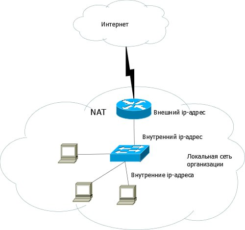{#fig:001 width=30%}

## Содержание исследования

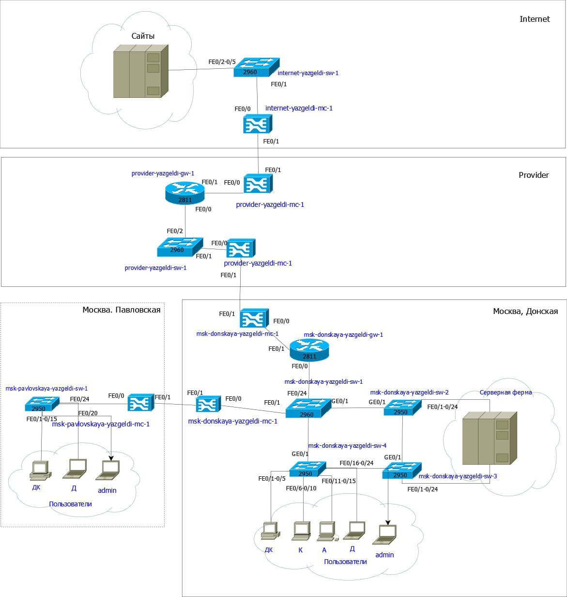{#fig:002 width=30%}

## Содержание исследования

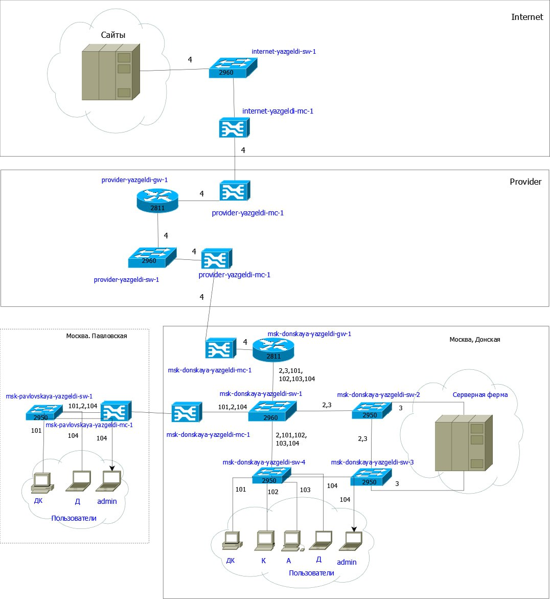{#fig:003 width=30%}

## Содержание исследования

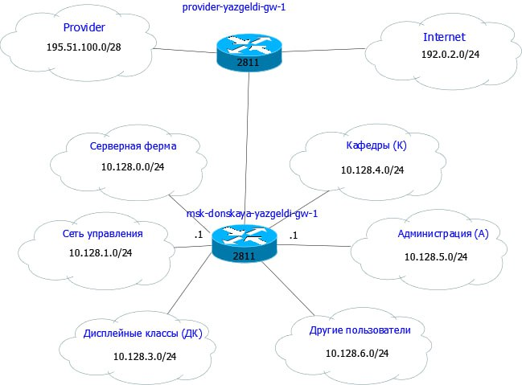{#fig:004 width=30%}

## Содержание исследования

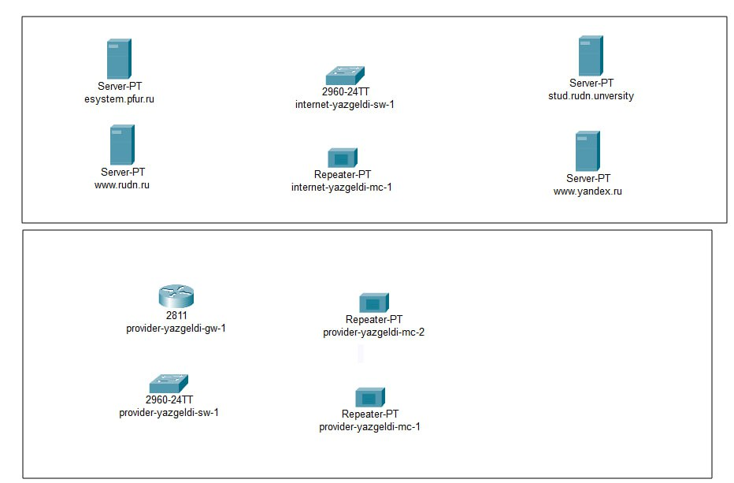{#fig:005 width=40%}

## Содержание исследования

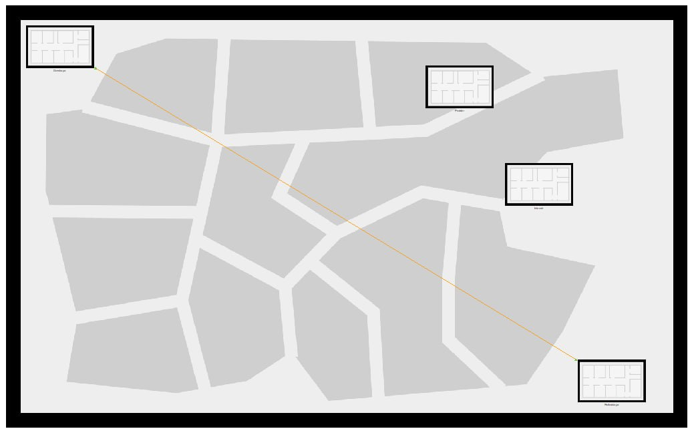{#fig:006 width=50%}

## Содержание исследования

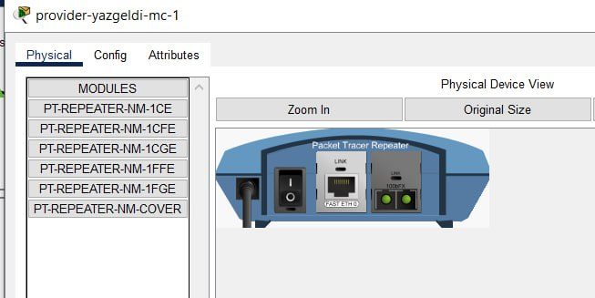{#fig:007 width=50%}

## Содержание исследования

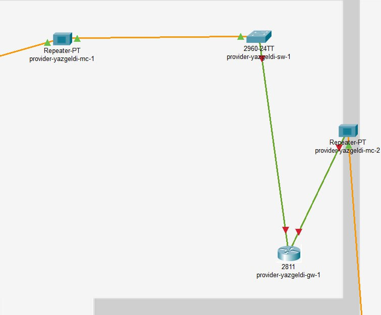{#fig:008 width=50%}

## Содержание исследования

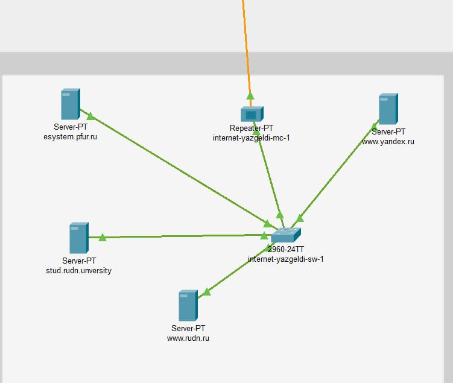{#fig:009 width=50%}

## Содержание исследования

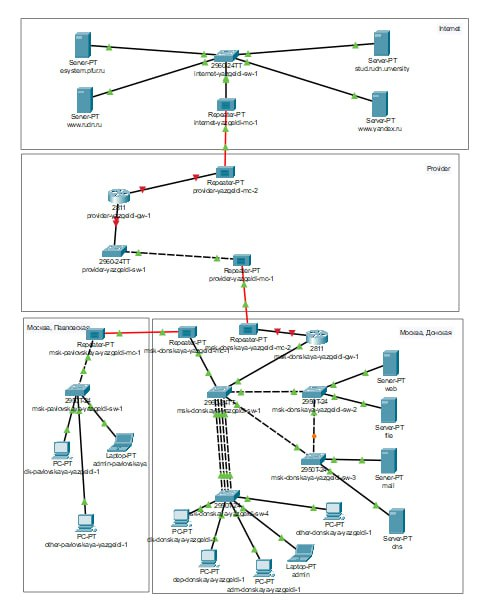{#fig:010 width=30%}

## Содержание исследования

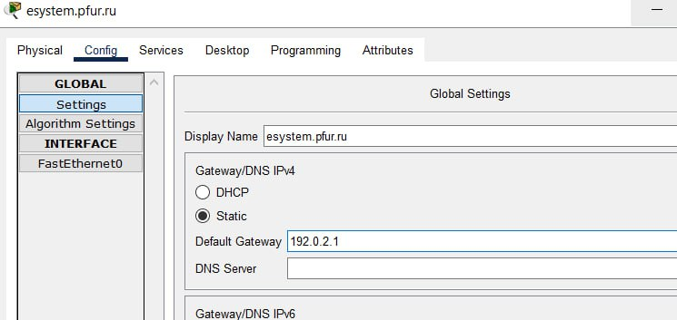{#fig:011 width=50%}

## Содержание исследования

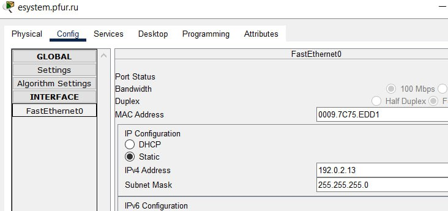{#fig:012 width=50%}

## Содержание исследования

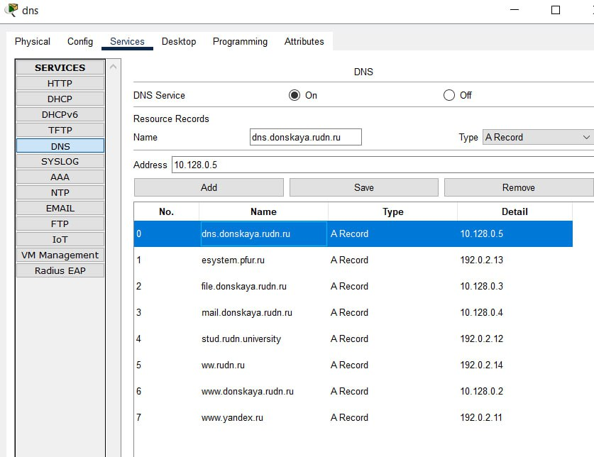{#fig:013 width=60%}

## Результаты

В процессе выполнения лабораторной работы мы провели подготовку по подключению локальной сети организации к Интернету
