---
## Front matter
title: "Лабораторная работа № 11"
subtitle: "Настройка NAT.Планирование"
author: "Оразгелдиев Язгелди"

## Generic otions
lang: ru-RU
toc-title: "Содержание"

## Bibliography
bibliography: bib/cite.bib
csl: pandoc/csl/gost-r-7-0-5-2008-numeric.csl

## Pdf output format
toc: true # Table of contents
toc-depth: 2
lof: true # List of figures
lot: true # List of tables
fontsize: 12pt
linestretch: 1.5
papersize: a4
documentclass: scrreprt
## I18n polyglossia
polyglossia-lang:
  name: russian
  options:
	- spelling=modern
	- babelshorthands=true
polyglossia-otherlangs:
  name: english
## I18n babel
babel-lang: russian
babel-otherlangs: english
## Fonts
mainfont: IBM Plex Serif
romanfont: IBM Plex Serif
sansfont: IBM Plex Sans
monofont: IBM Plex Mono
mathfont: STIX Two Math
mainfontoptions: Ligatures=Common,Ligatures=TeX,Scale=0.94
romanfontoptions: Ligatures=Common,Ligatures=TeX,Scale=0.94
sansfontoptions: Ligatures=Common,Ligatures=TeX,Scale=MatchLowercase,Scale=0.94
monofontoptions: Scale=MatchLowercase,Scale=0.94,FakeStretch=0.9
mathfontoptions:
## Biblatex
biblatex: true
biblio-style: "gost-numeric"
biblatexoptions:
  - parentracker=true
  - backend=biber
  - hyperref=auto
  - language=auto
  - autolang=other*
  - citestyle=gost-numeric
## Pandoc-crossref LaTeX customization
figureTitle: "Рис."
tableTitle: "Таблица"
listingTitle: "Листинг"
lofTitle: "Список иллюстраций"
lotTitle: "Список таблиц"
lolTitle: "Листинги"
## Misc options
indent: true
header-includes:
  - \usepackage{indentfirst}
  - \usepackage{float} # keep figures where there are in the text
  - \floatplacement{figure}{H} # keep figures where there are in the text
---

# Цель работы

Провести подготовительные мероприятия по подключению локальной сети организации к Интернету.

# Задание

1. Построить схему подсоединения локальной сети к Интернету;
2. Построить модельные сети провайдера и сети Интернет;
3. Построить схемы сетей L1, L2, L3;
4. При выполнении работы необходимо учитывать соглашение об именовании.

# Выполнение лабораторной работы

Модельные предположения:
- В сети провайдера располагаются 2 медиаконвертера provider-mc-1 и provider-mc-2 для связи с подсетью «Донская» и сетью модельного Интернета, маршрутизатор provider-gw-1 и коммутатор provider-sw-1. Оборудование соединяется между собой по Fast Ethernet согласно схеме.
- В модельной сети Интернет располагаются 4 сервера www.yandex.ru, www.rudn.ru, stud.rudn.university и esystem.pfur.ru, коммутатор internet-sw-1 и медиаконвертер internet-mc-1 для связи с сетью провайдера. Серверы подключены к коммутатору посредством Fast Ethernet, коммутатор подсоединён к медиаконвертеру также по Fast Ethernet.
- Имена и адреса серверам Интернета и маршрутизатору провайдера задаются согласно табл. 11.1. При этом учитывается, что под сеть адресов модельного Интернета выделяется адрес 192.0.2.0/24, а под сеть провайдера 198.51.100.1

Network Address Translation (NAT) — механизм преобразования IP-адресов транзитных пакетов. В частности, механизм NAT используется для обеспечения доступа устройств локальных сетей с внутренними IP-адресами к сети Интернет .

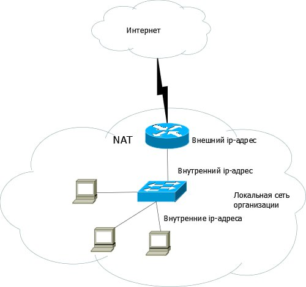{#fig:001 width=70%}

Внесли изменения в схему в схему L1 сети, добавив в неё сеть провайдера и сеть модельного Интернета с указанием названий оборудования и портов подключения.

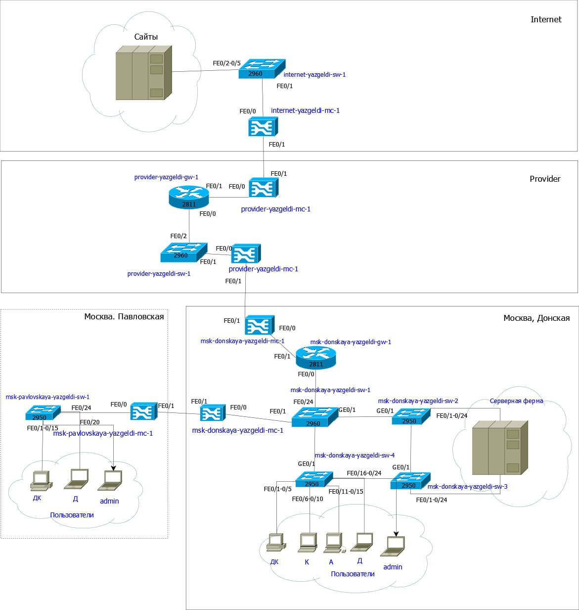{#fig:002 width=70%}

Внесли изменения в  схемы L2 и L3 сети, указав адреса и VLAN сети провайдера и модельной сети Интернета. Скорректировали таблицы распределения IP-адресов и портов.

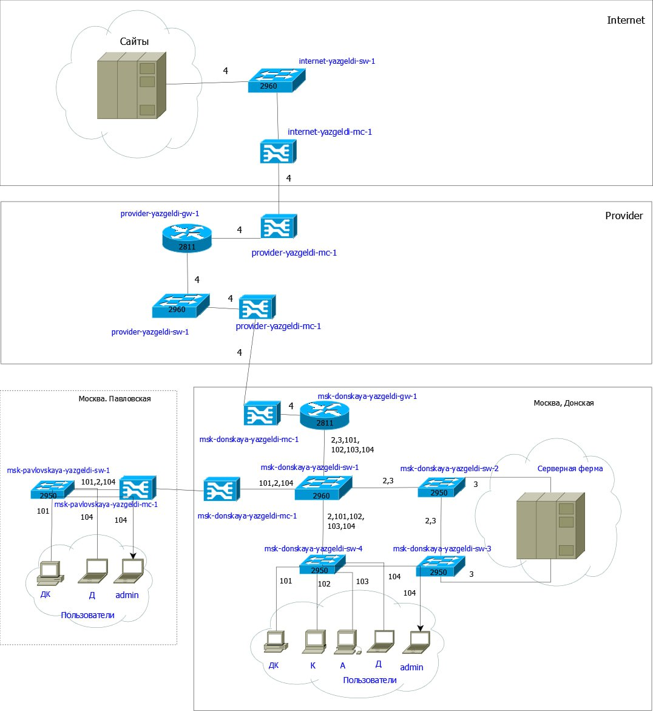{#fig:003 width=70%}

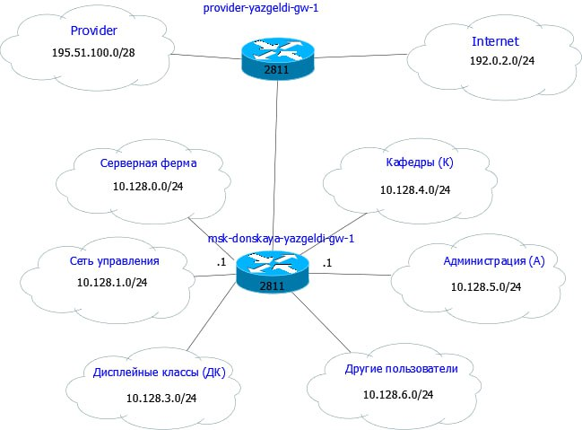{#fig:004 width=70%}

В итоге в схему рабочей среды мы добавили: 4 медиаконвертера, 2 коммутатора типа Cisco 2960-24Т, маршрутизатор типа Cisco 2811, 4 сервера. Присвоили им названия 

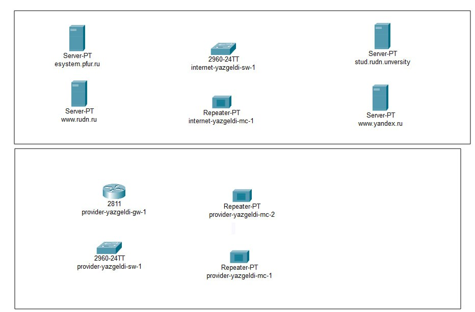{#fig:005 width=70%}

В физической области добавили 2 здания: провайдер и интернет. Присвоили им имена, перенесли из сети Донская оборудование провайдера и модельной сети в соответствующие здания

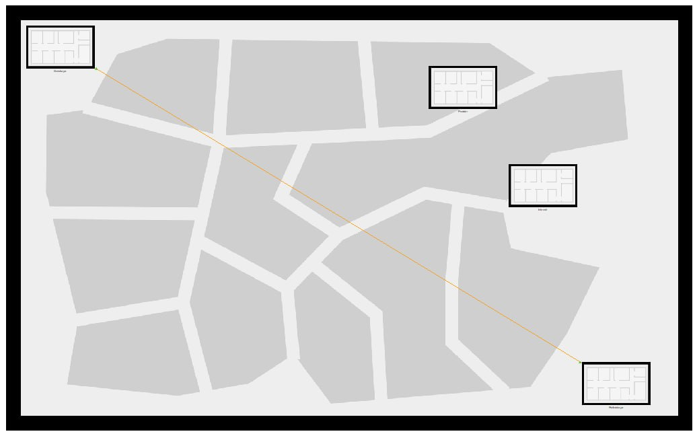{#fig:006 width=70%}

На медиаконвертерах заменили имеющиеся модули на PT-REPEATERNM-1FFE и PT-REPEATER-NM-1CFE для подключения витой пары по технологии Fast Ethernet и оптоволокна соответственно

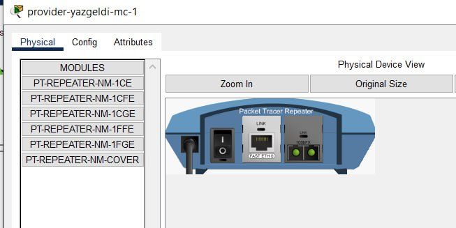{#fig:007 width=70%}

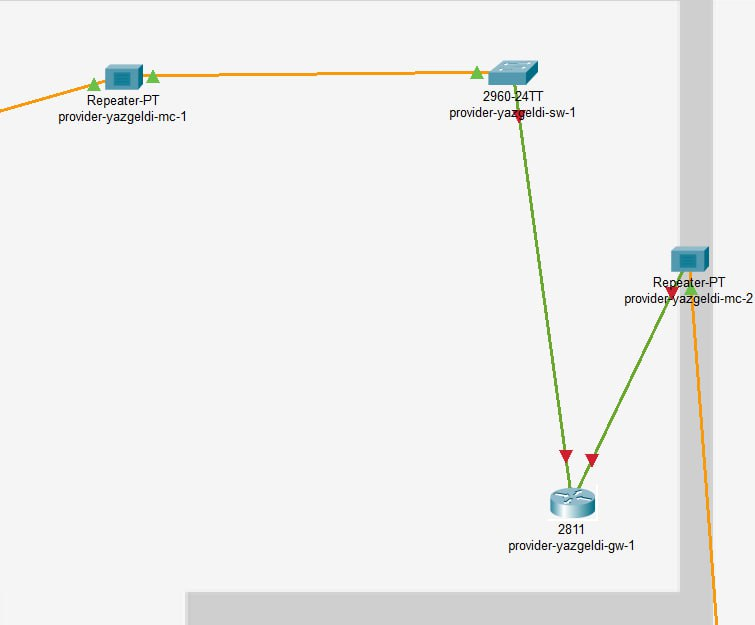{#fig:008 width=70%}

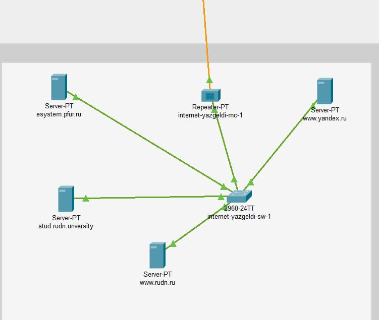{#fig:009 width=70%}

Проведем соединение объектов согласно скорректированной схеме L1

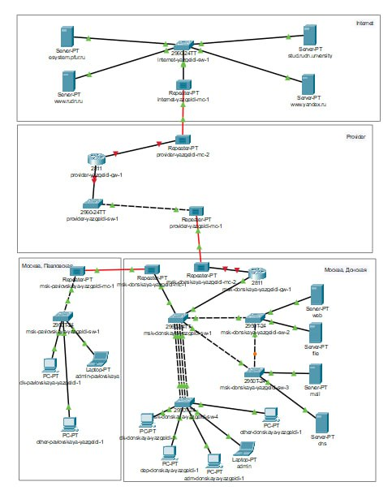{#fig:010 width=70%}

Прописали IP-адреса серверам согласно таблице. В качестве примера ниже представлено задание данных одному из серверов

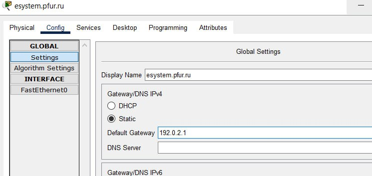{#fig:011 width=70%}

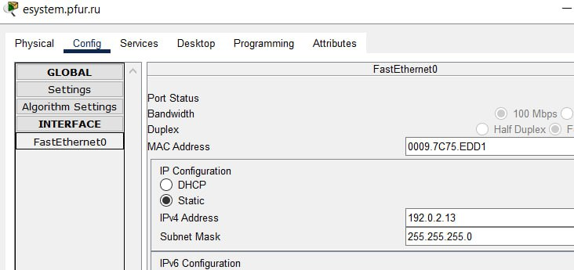{#fig:012 width=70%}

Задали сведения о серверах и прописали их на ДНС сервере сети Донская

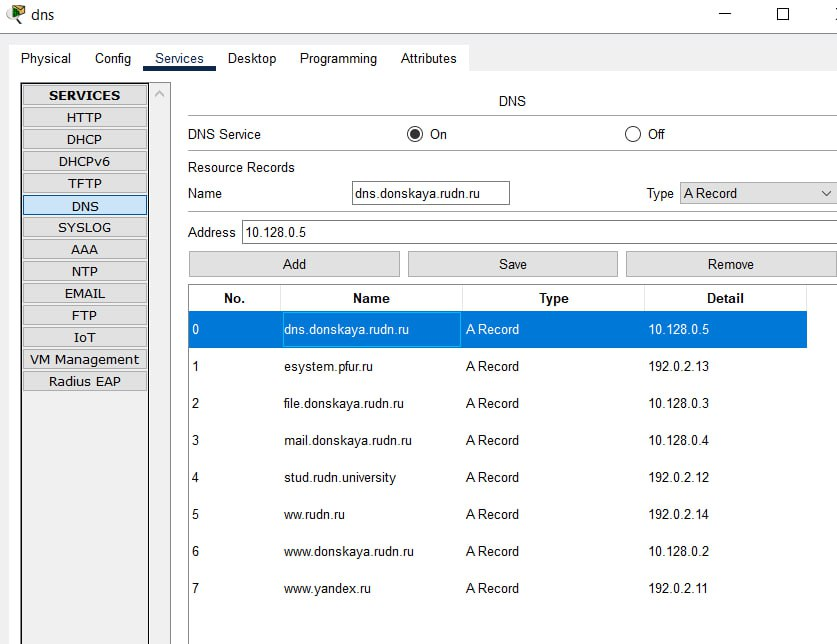{#fig:013 width=70%}

# Выводы

В процессе выполнения лабораторной работы мы провели подготовку по подключению локальной сети организации к Интернету

# Контрольные вопросы

1. Что такое Network Address Translation (NAT)?
Network Address Translation (NAT) — механизм преобразования IP-адресов транзитных пакетов. В частности, механизм NAT используется для обеспечения доступа устройств локальных сетей с внутренними IP-адресами к сети Интернет.
2. Как определить, находится ли узел сети за NAT?
Проанализирорвать конфигурации маршрутизатора или другого сетевого оборудования, которое может выполнять функции NAT.
3. Какое оборудование отвечает за преобразование адреса методом NAT?
Преобразование адреса методом NAT может производиться почти любым маршрутизирующим устройством — маршрутизатором, сервером доступа, межсетевым экраном. Наиболее популярным является SNAT, суть механизма
которого состоит в замене адреса источника (англ. source) при прохождении пакета в одну сторону и обратной замене адреса назначения (англ. destination) в ответном пакете.
4. В чём отличие статического, динамического и перегруженного NAT?
Статический осуществляет преобразование адресов по принципу 1:1, динамический 1:N, а перегруженный N:1.
5. Охарактеризуйте типы NAT.
Типы NAT: - статический NAT (Static NAT, SNAT) – осуществляет преобразование адресов по принципу 1:1 (в частности, один локальный IP-адрес преобразуется во внешний адрес, выделенный, например, провайдером); - динамический NAT (Dynamic NAT, DNAT) – осуществляет преобразование адресов по принципу 1:N (например, один адрес устройства локальной сети преобразуется в один из адресов диапазона внешних адресов); - NAT Overload (или NAT Masquerading, или Port Address Translation, PAT) – осуществляет преобразование адресов по принципу N:1 (например, адреса группы устройств локальной подсети преобразуются в один внешний адрес, при этом дополнительно используется механизм адресации через номера портов).

