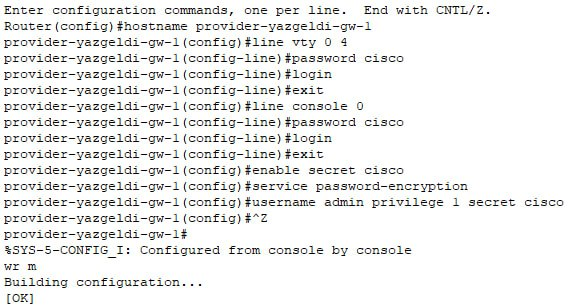

---
## Front matter
title: "Лабораторная работа № 12"
subtitle: "Настройка NAT"
author: "Оразгелдиев Язгелди"

## Generic otions
lang: ru-RU
toc-title: "Содержание"

## Bibliography
bibliography: bib/cite.bib
csl: pandoc/csl/gost-r-7-0-5-2008-numeric.csl

## Pdf output format
toc: true # Table of contents
toc-depth: 2
lof: true # List of figures
lot: true # List of tables
fontsize: 12pt
linestretch: 1.5
papersize: a4
documentclass: scrreprt
## I18n polyglossia
polyglossia-lang:
  name: russian
  options:
	- spelling=modern
	- babelshorthands=true
polyglossia-otherlangs:
  name: english
## I18n babel
babel-lang: russian
babel-otherlangs: english
## Fonts
mainfont: IBM Plex Serif
romanfont: IBM Plex Serif
sansfont: IBM Plex Sans
monofont: IBM Plex Mono
mathfont: STIX Two Math
mainfontoptions: Ligatures=Common,Ligatures=TeX,Scale=0.94
romanfontoptions: Ligatures=Common,Ligatures=TeX,Scale=0.94
sansfontoptions: Ligatures=Common,Ligatures=TeX,Scale=MatchLowercase,Scale=0.94
monofontoptions: Scale=MatchLowercase,Scale=0.94,FakeStretch=0.9
mathfontoptions:
## Biblatex
biblatex: true
biblio-style: "gost-numeric"
biblatexoptions:
  - parentracker=true
  - backend=biber
  - hyperref=auto
  - language=auto
  - autolang=other*
  - citestyle=gost-numeric
## Pandoc-crossref LaTeX customization
figureTitle: "Рис."
tableTitle: "Таблица"
listingTitle: "Листинг"
lofTitle: "Список иллюстраций"
lotTitle: "Список таблиц"
lolTitle: "Листинги"
## Misc options
indent: true
header-includes:
  - \usepackage{indentfirst}
  - \usepackage{float} # keep figures where there are in the text
  - \floatplacement{figure}{H} # keep figures where there are in the text
---

# Цель работы

Приобретение практических навыков по настройке доступа локальной сети
к внешней сети посредством NAT.

# Задание

1. Сделать первоначальную настройку маршрутизатора provider-gw-1 и коммутатора provider-sw-1 провайдера: задать имя, настроить доступ по паролю и т.п.
2. Настроить интерфейсы маршрутизатора provider-gw-1 и коммутатора provider-sw-1 провайдера.
3. Настроить интерфейсы маршрутизатора сети «Донская» для доступа к сети провайдера.
4. Настроить на маршрутизаторе сети «Донская» NAT с правилами.
5. Настроить доступ из внешней сети в локальную сеть организации
6. Проверить работоспособность заданных настроек.
7. При выполнении работы необходимо учитывать соглашение об именовании

# Выполнение лабораторной работы

Проведем первоначальную настройку маршрутизатора provider-gw-1. Зададим имя, настроим доступ по паролю.

{#fig:001 width=70%}

Также проведем первоначальную настройку маршрутизатора provider-sw-1. Зададим имя, настроим доступ по паролю.

{#fig:002 width=70%}

Проведем настройку интерфейсов маршрутизатора provider-gw-1. Поднимем интерфейс f0/0, создадим интерфейс f0/0.4 для 4 vlan и зададим ip-адрес, поднимем интерфейс f0/1.

{#fig:003 width=70%}

Проведем настройку интерфейсов коммутатора provider-sw-1. Сделаем порты f0/1 и f0/2 транковыми, зададим 4 vlan с именем net.

{#fig:004 width=70%}

Проведем настройку интерфейсов маршрутизатора msk-donskaya-gw-1. Поднимем интерфейс f0/1, создадим интерфейс f0/1.4 для 4 vlan и зададим ip-адрес.

{#fig:005 width=70%}

Проверим доступ с маршрутизатора на Донской к маршрутизатору провайдера.

{#fig:006 width=70%}

Настроим пул адресов для NAT, а именно 198.51.100.2 - 198.51.100.14

{#fig:007 width=70%}

Теперь настроим список доступа к NAT на всех подсетях для пользователей.

{#fig:008 width=70%}

Настройка РАТ на субинтерфейсах маршрутизатора с территории Донская.

{#fig:009 width=70%}

Проверим доступность к маршрутизаторам от ноутбука админ.

{#fig:010 width=70%}

Настроим доступ из интернета

{#fig:011 width=70%}

Проверим доступ к необходимым интернет-ресурсам конечных устройств сети

{#fig:012 width=70%}

{#fig:013 width=70%}

{#fig:014 width=70%}

{#fig:015 width=70%}

# Выводы

В результате выполнения лабораторной работы я приобрел навыки по настройке доступа локальной сети к внешней сети посредством NAT
