---
## Front matter
lang: ru-RU
title: Лабораторная работа № 13
subtitle: Статическая маршрутизация в Интернете. Планирование
author:
  - Оразгелдиев Язгелди
institute:
  - Российский университет дружбы народов, Москва, Россия

## i18n babel
babel-lang: russian
babel-otherlangs: english

## Formatting pdf
toc: false
toc-title: Содержание
slide_level: 2
aspectratio: 169
section-titles: true
theme: metropolis
header-includes:
 - \metroset{progressbar=frametitle,sectionpage=progressbar,numbering=fraction}
---

# Информация

## Докладчик

  * Оразгелдиев Язгелди
  * студент
  * Российский университет дружбы народов
  * [orazgeldiyev.yazgeldi@gmail.com](mailto:orazgeldiyev.yazgeldi@gmail.com)
  * <https://github.com/YazgeldiOrazgeldiyev>

## Цель работы

Провести подготовительные мероприятия по организации взаимодействия через сеть провайдера посредством статической маршрутизации локальной сети с сетью основного здания, расположенного в 42-м квартале в Москве, и сетью филиала, расположенного в г. Сочи.

## Задание

1. Внести изменения в схемы L1, L2 и L3 сети, добавив в них информацию о сети основной территории (42-й квартал в Москве) и сети филиала в г. Сочи.
2. Дополнить схему проекта, добавив подсеть основной территории организации 42-го квартала в Москве и подсеть филиала в г. Сочи.
3. Сделать первоначальную настройку добавленного в проект оборудования
4. При выполнении работы необходимо учитывать соглашение об именовании

## Содержание исследования

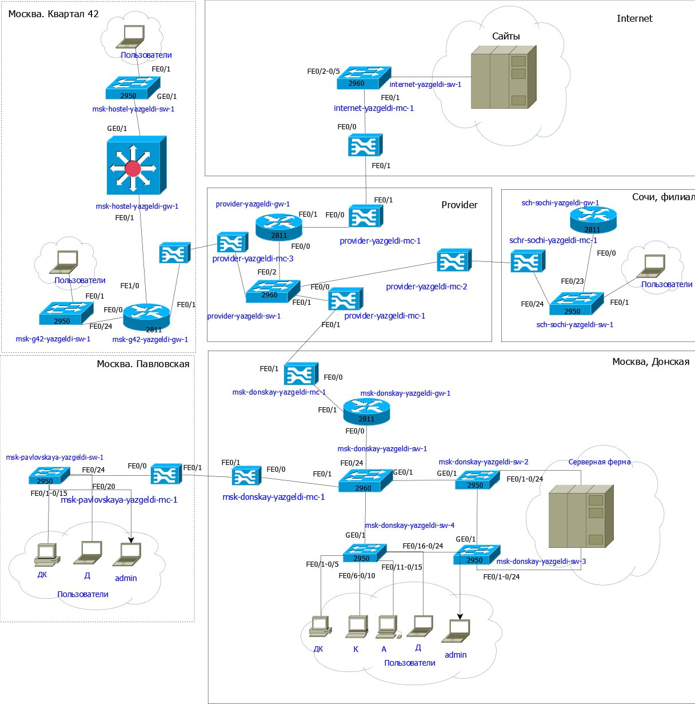{#fig:001 width=40%}

## Содержание исследования

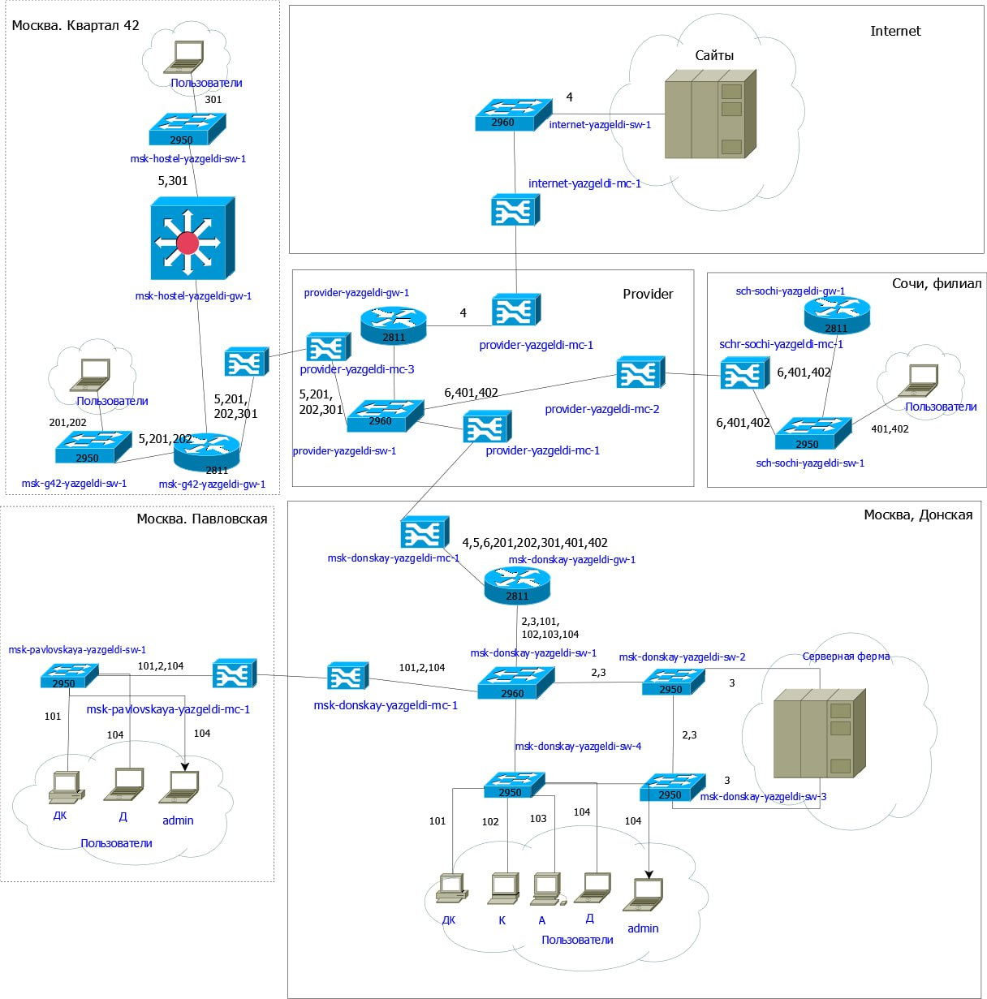{#fig:002 width=40%}

## Содержание исследования

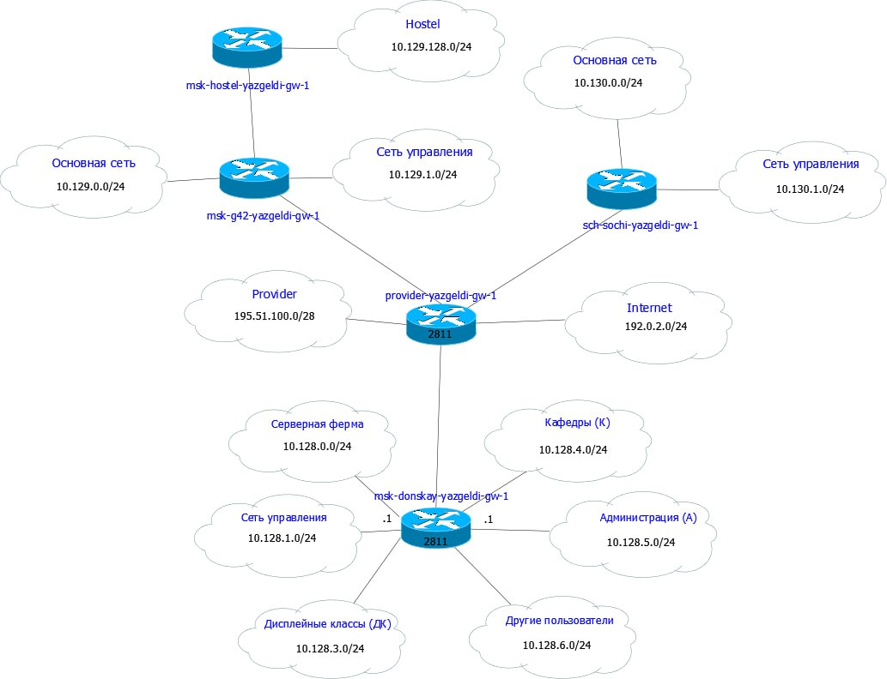{#fig:003 width=40%}

## Содержание исследования

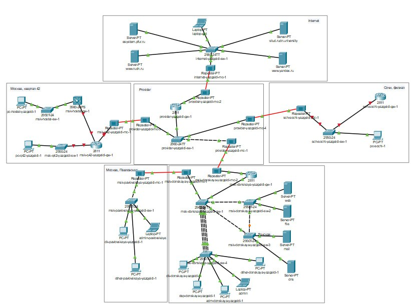{#fig:004 width=30%}

## Содержание исследования

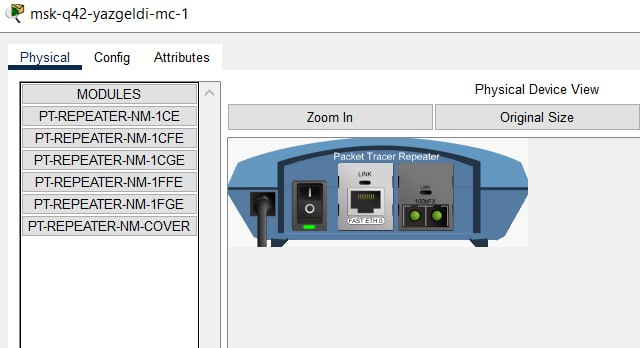{#fig:005 width=50%}

## Содержание исследования

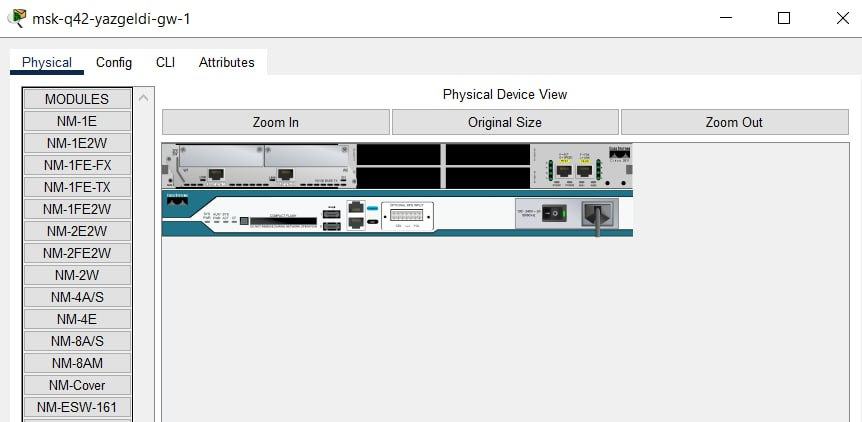{#fig:006 width=50%}

## Содержание исследования

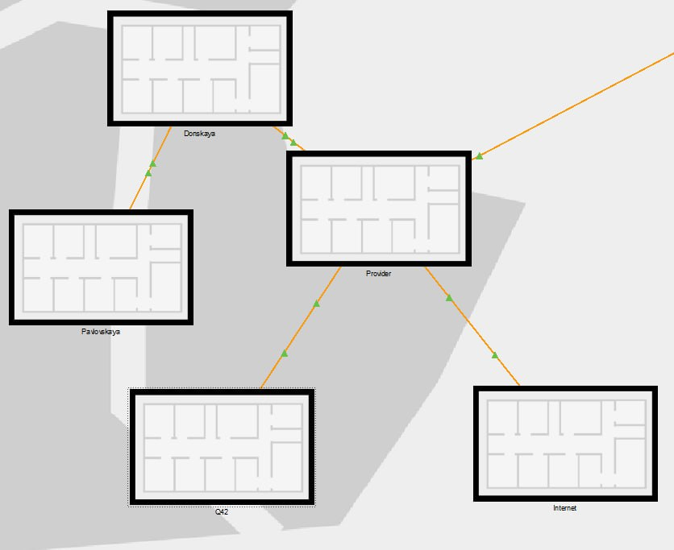{#fig:007 width=50%}

## Содержание исследования

{#fig:008 width=50%}

## Содержание исследования

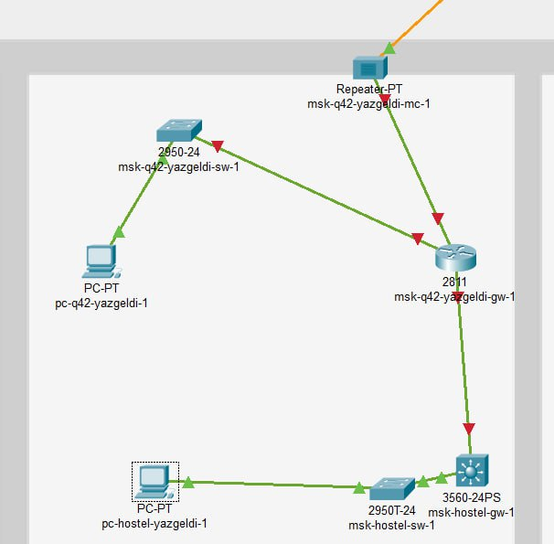{#fig:009 width=50%}

## Содержание исследования

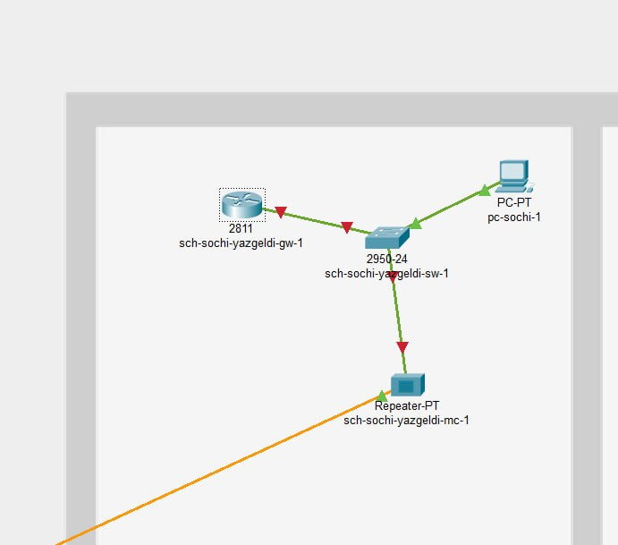{#fig:010 width=50%}

## Содержание исследования

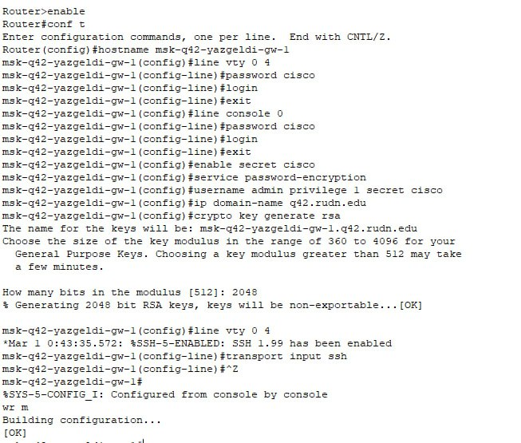{#fig:011 width=50%}

## Содержание исследования

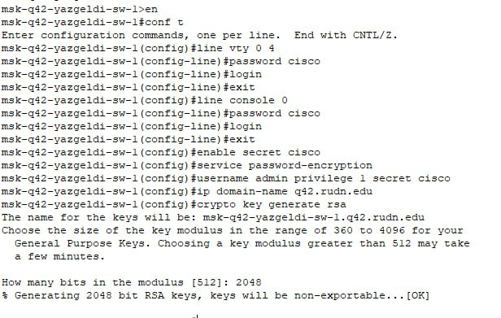{#fig:012 width=50%}

## Содержание исследования

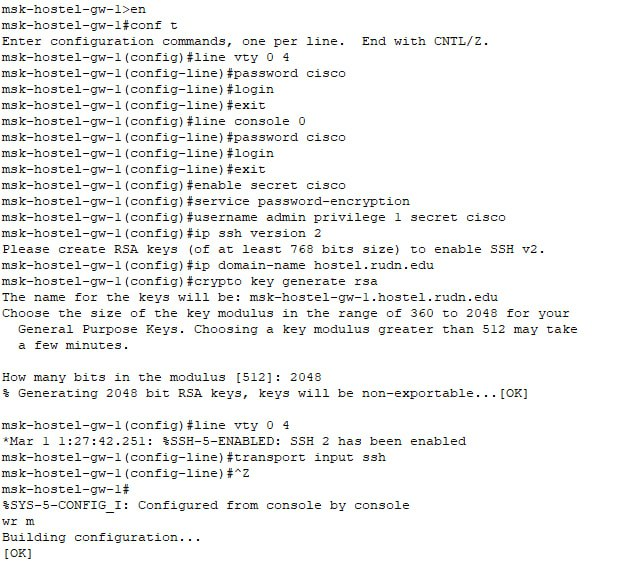{#fig:013 width=50%}

## Содержание исследования

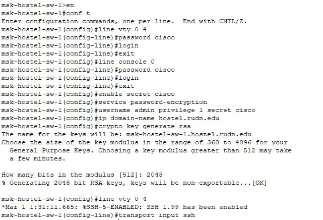{#fig:014 width=50%}

## Содержание исследования

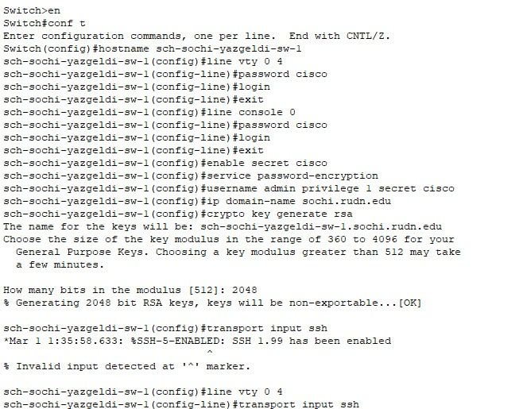{#fig:015 width=50%}

## Содержание исследования

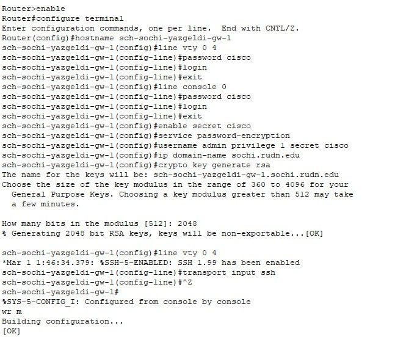{#fig:016 width=50%}

## Результаты

Я провел подготовительные мероприятия по организации взаимодействия через сеть провайдера посредством маршрутизации локальной сети с сетью основного здания расположенного в 42-м квартале в Москве и сетью филиала в Сочи
